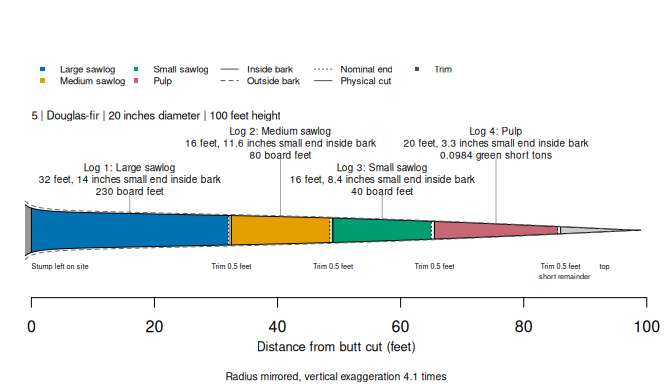

# merchandiser 

merchandiser calculates log dimensions, product volumes, and values from
tree measurements, taper equations, product tables, and recorded
defects. It also fits heights and taper, estimates biomass and carbon,
converts volume to green weight, and compiles expanded inventory
summaries. Results retain calculation statuses and assumptions.

## Install

Install from the package repository with `remotes`.

``` r
## Load the installer
library(remotes)

## Install merchandiser from its source repository
install_github(repo = 'siskiyoubiometrics/merchandiser')
```

## Select and scale logs

The shipped tree is a synthetic example. The four products below are
three Scribner sawlogs and green-ton pulp, with illustrative prices in
United States dollars (`USD`).

``` r
## Load the packages
library(merchandiser)
library(dplyr)

## Select the example tree
tree <- example_trees %>%
  filter(tree == 5)

## Define each product: lengths, small end limit, trim, unit, and price
large <- product(product = 'Large sawlog',
                 priority = 1,  ## 1 is offered the stem first
                 lengths = 32,  ## feet
                 min_sed = 12,  ## inches, small end diameter
                 inside_bark = TRUE,  ## diameter limit is inside bark
                 trim = 0.5,  ## feet added to each log
                 volume_unit = 'scribner',  ## Scribner board feet
                 price = 900,  ## dollars
                 price_per = 1000)  ## per thousand board feet

medium <- product(product = 'Medium sawlog',
                  priority = 2,  ## 1 is offered the stem first
                  lengths = 16,  ## feet
                  min_sed = 10,  ## inches, small end diameter
                  inside_bark = TRUE,  ## diameter limit is inside bark
                  trim = 0.5,  ## feet added to each log
                  volume_unit = 'scribner',  ## Scribner board feet
                  price = 700,  ## dollars
                  price_per = 1000)  ## per thousand board feet

small <- product(product = 'Small sawlog',
                 priority = 3,  ## 1 is offered the stem first
                 lengths = 16,  ## feet
                 min_sed = 6,  ## inches, small end diameter
                 inside_bark = TRUE,  ## diameter limit is inside bark
                 trim = 0.5,  ## feet added to each log
                 volume_unit = 'scribner',  ## Scribner board feet
                 price = 500,  ## dollars
                 price_per = 1000)  ## per thousand board feet

pulp <- product(product = 'Pulp',
                priority = 4,  ## 1 is offered the stem first
                min_length = 8,  ## feet
                max_length = 20,  ## feet
                length_step = 1,  ## feet
                min_sed = 3,  ## inches, small end diameter
                inside_bark = TRUE,  ## diameter limit is inside bark
                trim = 0.5,  ## feet added to each log
                volume_unit = 'green_ton',  ## green short tons
                price = 30,  ## dollars
                price_per = 1,  ## per ton
                accepts_pulp_restriction = TRUE)  ## takes stem a cruiser called pulp only

## Combine the products into one specification table
specifications <- products(large, medium, small, pulp)
```

``` r
## Select logs from the tree
result <- merchandise(dbh = tree$dbh,
                      ht = tree$ht,
                      model = tree$model,
                      species = tree$species,
                      id = tree$tree,
                      products = specifications,
                      currency = 'USD',
                      status = TRUE)
```

| Log | Product       | Length (ft) | Small end inside bark (in) | Net scale | Unit             | Value (USD) |
|----:|:--------------|------------:|---------------------------:|----------:|:-----------------|------------:|
|   1 | Large sawlog  |          32 |                     14.017 |   230.000 | board feet       |     207.000 |
|   2 | Medium sawlog |          16 |                     11.643 |    80.000 | board feet       |      56.000 |
|   3 | Small sawlog  |          16 |                      8.413 |    40.000 | board feet       |      20.000 |
|   4 | Pulp          |          20 |                      3.341 |     0.098 | green short tons |       2.951 |

``` r
## Draw the selected logs
plot(result)
```

<!-- -->

`net_scale` uses the unit shown in `scale_unit`. The result also
contains tree totals, residual intervals, deductions, and values.

## Biomass and carbon

`biomass()` returns component masses and aboveground carbon from tree
measurements.

``` r
## Select three example trees
trees <- example_trees_pnw %>%
  slice_head(n = 3)

## Estimate dry biomass and carbon in pounds
mass <- biomass(dbh = trees$dbh,
                ht = trees$ht_simulated,
                spcd = trees$spcd,
                division = 0,  ## national coefficients
                id = trees$tree,
                status = TRUE)
```

| Tree | Stem wood (lb) | Stem bark (lb) | Branches (lb) | Carbon (lb) |
|-----:|---------------:|---------------:|--------------:|------------:|
|    1 |           4768 |            726 |           459 |        3072 |
|    2 |            486 |             84 |            94 |         343 |
|    3 |            679 |            116 |           130 |         477 |

`biomass_component()` returns a selected component. `co2e()` returns
metric tons of carbon dioxide equivalent. `green_weight()` converts
supplied cubic volume using species wood and bark properties.

## Package site

- [Get
  started](https://siskiyoubiometrics.github.io/merchandiser/articles/get-started.html).
- [Defining
  products](https://siskiyoubiometrics.github.io/merchandiser/articles/defining-products.html).
- [Recording
  defect](https://siskiyoubiometrics.github.io/merchandiser/articles/defect-recording-conventions.html).
- [Fitting and completing
  heights](https://siskiyoubiometrics.github.io/merchandiser/articles/fill-missing-heights.html).
- [Taper and stem
  profiles](https://siskiyoubiometrics.github.io/merchandiser/articles/taper-profiles.html).
- [Volumes and
  scaling](https://siskiyoubiometrics.github.io/merchandiser/articles/volumes-scaling.html).
- [Biomass, carbon, and green
  weight](https://siskiyoubiometrics.github.io/merchandiser/articles/biomass-carbon.html).
- [Compiling an
  inventory](https://siskiyoubiometrics.github.io/merchandiser/articles/compiling-inventory.html).
- [Bucking choices and
  prices](https://siskiyoubiometrics.github.io/merchandiser/articles/bucking-prices.html).
- [Assumptions and
  status](https://siskiyoubiometrics.github.io/merchandiser/articles/assumptions-status.html).
- [Taper equation
  methods](https://siskiyoubiometrics.github.io/merchandiser/articles/methods-taper-equations.html).
- [Fitting taper
  equations](https://siskiyoubiometrics.github.io/merchandiser/articles/methods-fitting-taper.html).
- [Stem model
  calculations](https://siskiyoubiometrics.github.io/merchandiser/articles/stem-model-overview.html).
- [Source
  agreement](https://siskiyoubiometrics.github.io/merchandiser/articles/oracle-agreement.html).
- [Identifiers and
  defaults](https://siskiyoubiometrics.github.io/merchandiser/articles/identifiers-defaults.html).
- [Function
  reference](https://siskiyoubiometrics.github.io/merchandiser/reference/index.html).
