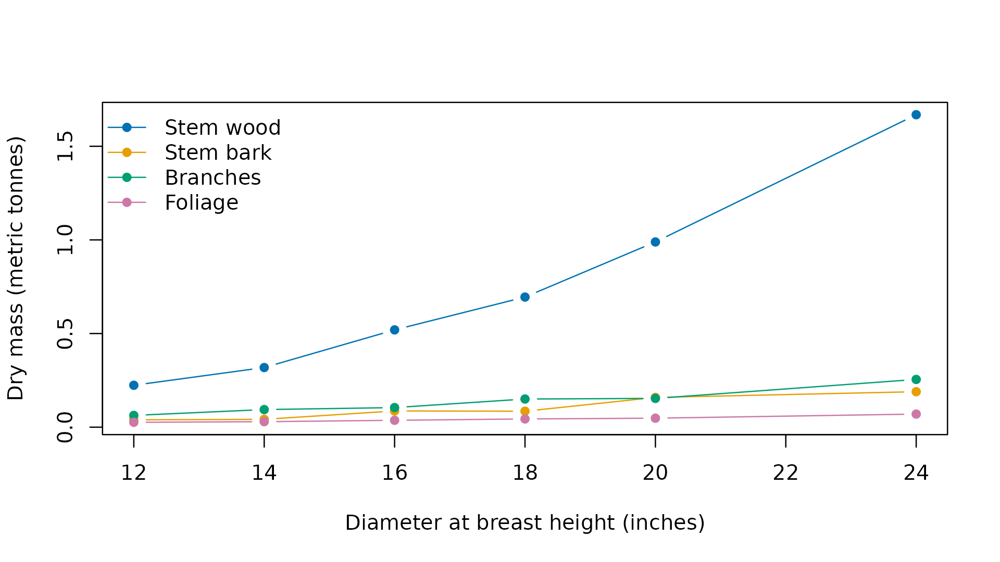

# Biomass and carbon

[`biomass()`](https://siskiyoubiometrics.com/merchandiser/reference/biomass.md)
estimates dry biomass and carbon in metric tonnes from tree diameters in
inches and total heights in feet. Use it to attach tree mass estimates
to a measured or completed tree list, independently of product
specifications. National coefficients apply when no location code is
supplied, and results retain the input order for joining tree
identifiers.

## Which mass total should be used?

The aboveground total excludes foliage and contains stem wood, stem
bark, and branches. Roots are not estimated. Foliage is returned
separately, so it can be retained as a separate component or added to
that total when an aboveground total including foliage is needed.

Stem wood and bark are also partitioned into stump, sawlog, topwood, and
tip components. Those component columns overlap the whole-stem columns.
Likewise, `dry_top_and_limb` combines tip wood, tip bark, and branches,
so it must not be added to a total that already contains them.

``` r

## Attach the calculation and data tools
library(merchandiser)
library(dplyr)
```

``` r

## Select the tree with a stored taper equation
tree <- example_trees %>%
  filter(tree_id == 5)
```

``` r

## Estimate the tree's mass without product specifications
mass <- biomass(dbh = tree$dbh,
                ht = tree$ht,
                spcd = tree$spcd)
```

| aboveground excluding foliage (tonnes) | stem wood (tonnes) | stem bark (tonnes) | branches (tonnes) | foliage (tonnes) |
|---:|---:|---:|---:|---:|
| 1.302 | 0.989 | 0.159 | 0.154 | 0.048 |

The tree’s aboveground dry mass excluding foliage is 1.302 tonnes, the
sum of its stem wood, stem bark, and branches.

The component boundaries use the biomass calculation’s own stem
assumptions. They do not read a merchandising result or its selected
logs. Changing a product’s length therefore does not change this
tree-level estimate. Optional component limits are documented in the
function reference when a different partition is required.

## How is carbon calculated?

[`carbon_fraction()`](https://siskiyoubiometrics.com/merchandiser/reference/carbon_fraction.md)
returns the species fraction of dry mass used by the biomass
calculation, with its source recorded as an attribute. Multiplying the
aboveground mass excluding foliage by that fraction gives carbon mass.
The carbon dioxide equivalent column converts carbon mass by the
molecular mass ratio used in the calculation.

``` r

## Inspect the species carbon fraction and its source
fraction <- carbon_fraction(spcd = tree$spcd)
```

| carbon / dry mass (fraction) |
|-----------------------------:|
|                        0.516 |

The fraction for this species is 0.516, applied to dry aboveground mass
excluding foliage. Its source attribute identifies the Forest Service
National Volume Estimator Library table and source routine.

``` r

## Check carbon against the returned dry mass
carbon_check <- mass %>%
  mutate(calculated_carbon = dry_aboveground_no_foliage * fraction)
```

| carbon (tonnes) | calculated carbon (tonnes) | carbon dioxide equivalent (tonnes) |
|---:|---:|---:|
| 0.672 | 0.672 | 2.463 |

The calculated and returned carbon masses agree at 0.672 tonnes. Foliage
carbon is not included in either value.

The result also includes a status for each input row. Invalid
measurements leave missing mass values in their original positions,
preserving alignment with the submitted list. The function does not
attach identifiers automatically.

## How do components vary across a tree list?

The same function accepts vectors, returning rows in input order. Bind
those rows to the original list before grouping by stand or species. The
figure separates components that can be added together and leaves
foliage visible as a separate series.

``` r

## Calculate masses for the shipped range of tree dimensions
trees <- example_trees %>%
  bind_cols(biomass(dbh = example_trees$dbh,
                    ht = example_trees$ht,
                    spcd = example_trees$spcd))
```

| tree_id | species code | diameter (inches) | stem wood (tonnes) | stem bark (tonnes) | branches (tonnes) | foliage (tonnes) |
|---:|---:|---:|---:|---:|---:|---:|
| 1 | 202 | 12 | 0.224 | 0.039 | 0.063 | 0.026 |
| 2 | 263 | 14 | 0.318 | 0.042 | 0.094 | 0.029 |
| 3 | 202 | 16 | 0.520 | 0.087 | 0.105 | 0.037 |
| 4 | 263 | 18 | 0.695 | 0.085 | 0.150 | 0.044 |
| 5 | 202 | 20 | 0.989 | 0.159 | 0.154 | 0.048 |
| 6 | 263 | 24 | 1.669 | 0.189 | 0.255 | 0.070 |

The first tree contributes 0.224 tonnes to the stem-wood series in the
figure.



The smallest example tree has 0.039 tonnes of dry stem bark. These
points combine the shipped species and heights, so the connecting lines
are not a fitted diameter-only relationship.

## How can location select coefficients?

The optional `division` argument accepts an ecological division code.
[`nsvb_division()`](https://siskiyoubiometrics.com/merchandiser/reference/nsvb_division.md)
looks it up from numeric state and county codes, and
[`nsvb_division_xy()`](https://siskiyoubiometrics.com/merchandiser/reference/nsvb_division_xy.md)
looks it up from coordinates. The coordinate lookup defaults to
longitude and latitude. Using another coordinate reference system
through `crs` requires the sf package, listed under Suggests.

``` r

## Look up coefficients using explicit state and county codes
county <- nsvb_division(state = 41, county = 5)

## Look up the shipped coordinates directly
location <- nsvb_division_xy(x = example_trees_pnw$longitude[1],
                             y = example_trees_pnw$latitude[1])
```

| lookup      | division code | status |
|:------------|--------------:|-------:|
| county      |          1242 |      0 |
| coordinates |          1240 |      0 |

The coordinate lookup returns division 1240. Check its status before
passing the returned code to
[`biomass()`](https://siskiyoubiometrics.com/merchandiser/reference/biomass.md),
since an unrecognized location is not a national-coefficient request.
