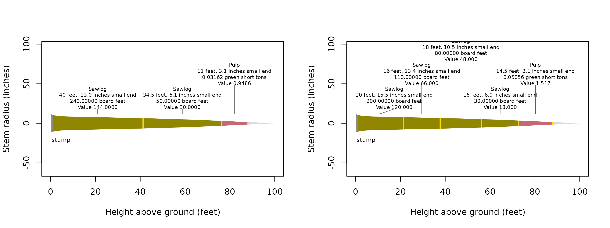

# Bucking strategy and value

Bucking strategy selects logs by product priority or by their combined
value. Compare the strategies when accepted lengths and prices offer
competing cuts within the same stem. This calculation uses the Get
started tree and its stored taper equation, with dimensions in inches
and feet and illustrative prices in United States dollars.

## What prices and dimensions compete?

The cascade offers each available section to products in the order
supplied to
[`products()`](https://siskiyoubiometrics.com/merchandiser/reference/products.md).
It takes the longest feasible sawlog at each step before assigning
remaining eligible wood to pulp. Prices value those selected logs
without changing their priority. Optimization compares combinations of
eligible cuts within each available segment.

``` r

## Attach the calculation and data tools
library(merchandiser)
library(dplyr)
```

``` r

## Select the tree with a stored taper equation
tree <- example_trees %>%
  filter(tree_id == 5)
```

``` r

## Accept sawlogs across the nominal length range
sawlog <- product(product = 'Sawlog',  ## product label
                  min_length = 16,  ## feet
                  max_length = 40,  ## feet
                  min_sed = 6,  ## inches
                  inside_bark = TRUE,  ## limits measured inside bark
                  trim = 0.5,  ## feet
                  volume_unit = 'scribner',  ## board feet
                  price = 600,  ## dollars
                  price_per = 1000)  ## board feet

## Assign remaining eligible sections to pulp by green weight
pulp <- product(product = 'Pulp',  ## product label
                min_length = 8,  ## feet
                max_length = 20,  ## feet
                min_sed = 3,  ## inches
                inside_bark = TRUE,  ## limits measured inside bark
                trim = 0.5,  ## feet
                volume_unit = 'green_ton',  ## green short tons
                price = 30,  ## dollars
                price_per = 1)  ## green short tons
```

``` r

## Set the cascade's product priority
specifications <- products(sawlog, pulp)
```

``` r

## Select logs in the supplied product order
cascade <- merchandise(tree_id = tree$tree_id,
                       dbh = tree$dbh,
                       ht = tree$ht,
                       spcd = tree$spcd,
                       products = specifications,
                       model = tree$model,
                       strategy = 'cascade')
```

``` r

## Select the combination with the greatest value
optimized <- merchandise(tree_id = tree$tree_id,
                         dbh = tree$dbh,
                         ht = tree$ht,
                         spcd = tree$spcd,
                         products = specifications,
                         model = tree$model,
                         strategy = 'optimize')
```

## Which strategy assigns the greater value?

Every product must have a finite positive price for optimization.
`price_per` puts that price on the product’s scale basis, allowing board
foot and weight products to contribute to one dollar objective. The
scale itself remains in each product’s own units.

``` r

## Compare dollar totals without combining unlike scale units
values <- bind_rows(cascade = cascade$logs,
                    optimized = optimized$logs,
                    .id = 'strategy') %>%
  group_by(strategy) %>%
  summarize(logs = n(),
            board_feet = sum(scale[volume_unit == 'scribner']),
            value = sum(value))
```

| strategy  | logs (count) | scale (Scribner board feet) | value (dollars) |
|:----------|-------------:|----------------------------:|----------------:|
| cascade   |            3 |                         290 |         174.949 |
| optimized |            5 |                         420 |         253.517 |

Cascade selects 3 logs totaling 290 Scribner board feet and about 175
dollars, while optimization selects 5 logs totaling 420 board feet and
about 254 dollars. Log counts and dollar totals include pulp, while the
board foot totals include only sawlogs.

## Where did the cuts change?

Each candidate occupies nominal length plus trim, while scale uses the
nominal body. Under the small end diameter rule, a shorter log carries a
larger small end diameter on this tapering stem. The longest feasible
log therefore need not produce the highest total scale. Here, shorter
sawlogs increase the board foot total despite the additional trim
allowances. The drawings retain the same colors for each product.

``` r

## Compare the selected cuts on the same stem
par(mfrow = c(1, 2))
plot(cascade)
plot(optimized)
```



The cascade drawing starts with a 40-foot sawlog, while the optimized
drawing starts with a 20-foot sawlog and contains 5 selected logs.

| strategy | log | product | start (feet) | end (feet) | nominal length (feet) | small-end diameter (inches) | scale (Scribner board feet) | scale (green short tons) | value (dollars) |
|:---|---:|:---|---:|---:|---:|---:|---:|---:|---:|
| cascade | 1 | Sawlog | 1.0 | 41.5 | 40.0 | 12.960 | 240 | NA | 144.000 |
| cascade | 2 | Sawlog | 41.5 | 76.5 | 34.5 | 6.055 | 50 | NA | 30.000 |
| cascade | 3 | Pulp | 76.5 | 88.0 | 11.0 | 3.073 | NA | 0.032 | 0.949 |
| optimized | 1 | Sawlog | 1.0 | 21.5 | 20.0 | 15.459 | 200 | NA | 120.000 |
| optimized | 2 | Sawlog | 21.5 | 38.0 | 16.0 | 13.441 | 110 | NA | 66.000 |
| optimized | 3 | Sawlog | 38.0 | 56.5 | 18.0 | 10.477 | 80 | NA | 48.000 |
| optimized | 4 | Sawlog | 56.5 | 73.0 | 16.0 | 6.910 | 30 | NA | 18.000 |
| optimized | 5 | Pulp | 73.0 | 88.0 | 14.5 | 3.073 | NA | 0.051 | 1.517 |

The first optimized sawlog has a physical small end diameter of 15.46
inches, compared with 12.96 inches for the first cascade sawlog.

## How are equal values resolved?

The optimizer uses dynamic programming over reachable cut positions and
eligible nominal lengths on a 0.5-foot grid. As documented in
[`merchandise()`](https://siskiyoubiometrics.com/merchandiser/reference/merchandise.md),
values within eight machine epsilons times the larger absolute value are
treated as ties. Among tied values it favors fewer logs, then compares
nominal lengths from the lower stem upward, favoring the first longer
log. Remaining ties favor the first lower physical end in the same
order. The final comparison uses byte order of serialized start heights,
physical ends, cut kinds, nominal lengths, and product names along each
path. These comparisons do not round the returned dollar values.

## What limits computation?

The state includes cut position and the counts of products with
`max_logs` limits. Cull and restriction boundaries divide the available
stem into segments and restart those counts. The algorithm compares
eligible continuations within that structure, rather than moving defects
or changing the supplied stem equation.

Without count limits, work grows with positions, products, and candidate
lengths. Retaining the chosen paths also costs time and memory
proportional to their log counts. Independently capped products multiply
the possible states by their count combinations, making the worst case
exponential in the number of capped products. Only reached states are
stored.

Preparation rejects an off-grid cut-position expansion exceeding 50,000
cut positions, the limit documented in
[`merchandise()`](https://siskiyoubiometrics.com/merchandiser/reference/merchandise.md).
Broad length ranges and several independent log caps can therefore make
a specification expensive even for a modest tree list. Trees use the
package’s parallel engine, but additional threads do not reduce the
number of candidate states required for a tree.
