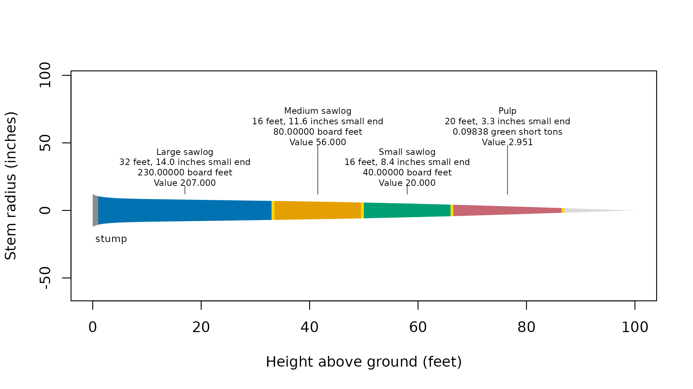

# Get started

[`merchandise()`](https://siskiyoubiometrics.com/merchandiser/reference/merchandise.md)
selects and scales logs from tree measurements and product
specifications. Product order sets cutting priority under the default
strategy. Prices assign value to the selected logs without changing that
priority.

Tree 5 is a synthetic example with species code 202, diameter at breast
height of 20 inches, and total height of 100 feet. Its stored equation
is passed explicitly below. Dimensions use inches and feet. Prices are
illustrative United States dollars.

``` r

## Attach the calculation and data tools
library(merchandiser)
library(dplyr)
```

``` r

## Select the tree with a stored taper equation
tree <- example_trees %>%
  filter(tree_id == 5)
```

| tree_id | species code | diameter (inches) | height (feet) |
|--------:|-------------:|------------------:|--------------:|
|       5 |          202 |                20 |           100 |

The tree’s 20-inch diameter and 100-foot height supply the measurements
for the log calculation.

## Which products can the tree supply?

``` r

## Give long logs with the largest small end limit first priority
large <- product(product = 'Large sawlog',  ## product label
                 min_length = 32,  ## feet
                 max_length = 32,  ## feet
                 min_sed = 12,  ## inches
                 inside_bark = TRUE,  ## limits measured inside bark
                 trim = 0.5,  ## feet
                 volume_unit = 'scribner',  ## board feet
                 price = 900,  ## dollars
                 price_per = 1000)  ## board feet

## Accept shorter logs that meet the medium sawlog diameter limit
medium <- product(product = 'Medium sawlog',  ## product label
                  min_length = 16,  ## feet
                  max_length = 16,  ## feet
                  min_sed = 10,  ## inches
                  inside_bark = TRUE,  ## limits measured inside bark
                  trim = 0.5,  ## feet
                  volume_unit = 'scribner',  ## board feet
                  price = 700,  ## dollars
                  price_per = 1000)  ## board feet

## Accept smaller sawlogs before assigning wood to pulp
small <- product(product = 'Small sawlog',  ## product label
                 min_length = 16,  ## feet
                 max_length = 16,  ## feet
                 min_sed = 6,  ## inches
                 inside_bark = TRUE,  ## limits measured inside bark
                 trim = 0.5,  ## feet
                 volume_unit = 'scribner',  ## board feet
                 price = 500,  ## dollars
                 price_per = 1000)  ## board feet

## Assign remaining eligible sections to pulp by green weight
pulp <- product(product = 'Pulp',  ## product label
                min_length = 8,  ## feet
                max_length = 20,  ## feet
                min_sed = 3,  ## inches
                inside_bark = TRUE,  ## limits measured inside bark
                trim = 0.5,  ## feet
                volume_unit = 'green_ton',  ## green short tons
                price = 30,  ## dollars
                price_per = 1)  ## green short tons
```

Each cut occupies the nominal log length plus trim. Scale uses the
nominal length, and trim remains in the residual record.

``` r

## Offer the stem to sawlog products before pulp
specifications <- products(large, medium, small, pulp)
```

``` r

## Select and price logs using the tree's stored taper equation
result <- merchandise(tree_id = tree$tree_id,
                      dbh = tree$dbh,
                      ht = tree$ht,
                      spcd = tree$spcd,
                      products = specifications,
                      model = tree$model)
```

The same specification can be applied to a tree list by supplying
measurement vectors and unique tree identifiers. Optional age and
pruning measurements are needed only when a product uses those limits.

## Which logs were selected?

| product | start (feet) | end including trim (feet) | nominal length (feet) | small-end diameter (inches) | scale (Scribner board feet) | scale (green short tons) | value (dollars) |
|:---|---:|---:|---:|---:|---:|---:|---:|
| Large sawlog | 1.0 | 33.5 | 32 | 14.017 | 230 | NA | 207.000 |
| Medium sawlog | 33.5 | 50.0 | 16 | 11.643 | 80 | NA | 56.000 |
| Small sawlog | 50.0 | 66.5 | 16 | 8.413 | 40 | NA | 20.000 |
| Pulp | 66.5 | 87.0 | 20 | 3.341 | NA | 0.098 | 2.951 |

The large sawlog contributes 207 dollars at the specified price of 900
dollars per 1000 board feet.

| scale (Scribner board feet) | price (dollars) | price basis (board feet) | calculated value (dollars) |
|---:|---:|---:|---:|
| 230 | 900 | 1000 | 207 |

Its 230 board feet supply the scale used in that value calculation.

The scale columns keep board feet and short tons separate. Add board
feet within a scaling rule and short tons within weight products, or add
dollar values across all priced products. Do not sum `result$logs$scale`
across these products because its rows use incompatible units.

The log record also includes physical end diameters and the diameter
used for board foot scaling. Physical ends include trim when checking
eligibility, while scale describes the nominal log body. Those columns
make it possible to check a particular cut against the specification
that accepted it.

## What happened to the rest of the stem?

The residual record accounts for stem sections outside the scaled log
bodies. Its causes distinguish the stump and top from trim, length
limits, diameter limits, and located defects. Residual heights use the
same ground reference as the log heights.

| tree_id | start (feet) | end (feet) | cause           |
|--------:|-------------:|-----------:|:----------------|
|       5 |        0.000 |      1.000 | stump           |
|       5 |       33.000 |     33.500 | trim            |
|       5 |       49.500 |     50.000 | trim            |
|       5 |       66.000 |     66.500 | trim            |
|       5 |       86.500 |     87.000 | trim            |
|       5 |       87.000 |     88.273 | short_remainder |
|       5 |       88.273 |    100.000 | top             |

The first residual ends at 1 foot, the stump height used for cutting.

## Did the calculation use valid inputs?

``` r

## Check for trees with a reported condition
result$status
#> [1] tree_id     status      name        description
#> <0 rows> (or 0-length row.names)
```

The status table has 0 rows, so this calculation reports no tree
conditions. A tree without eligible logs can still have valid inputs.
Check residual causes when the question is why wood was not assigned to
a product.

``` r

## Inspect the inputs recorded with the result
record <- assumptions(x = result)
```

| tree_id | assumption | spcd | model | value (see unit column) | unit | basis | product | source |
|---:|:---|---:|:---|---:|:---|:---|:---|:---|
| 5 | species_model | 202 | F00FW2W202 | NA | NA | NA | NA | caller_model |
| 5 | stump_height | 202 | F00FW2W202 | 1 | feet | NA | NA | stump_ht |

The `stump_height` row records 1 foot from `stump_ht`. The
`species_model` row records the selected equation and whether it came
from the caller or the species default. A `bark_ratio` row, when needed,
records the ratio, its basis, and its source. These are recorded inputs,
not adjustments to the selected logs.

## Where are the cuts on the stem?

``` r

## Draw the selected logs and unassigned stem sections
plot(result)
```



The drawing places the large sawlog at the base, starting above the 1
foot stump.

## What is the tree’s biomass?

Biomass estimates come from tree measurements independently of the
product list. The aboveground total includes stem wood, stem bark, and
branches. Foliage is returned separately, and roots are outside this
total.

``` r

## Estimate dry biomass and carbon for the same tree
mass <- biomass(dbh = tree$dbh,
                ht = tree$ht,
                spcd = tree$spcd)
```

| dry mass excluding foliage (tonnes) | carbon (tonnes) | carbon dioxide equivalent (tonnes) |
|---:|---:|---:|
| 1.302 | 0.672 | 2.463 |

The tree contains 1.302 metric tonnes of dry aboveground biomass
excluding foliage.

The biomass columns describe overlapping components, so do not sum every
mass column. Use [Biomass and
carbon](https://siskiyoubiometrics.com/merchandiser/articles/biomass-carbon.md)
to select a nonoverlapping total, or [Working a tree
list](https://siskiyoubiometrics.com/merchandiser/articles/tree-lists.md)
to carry these calculations across stands.
