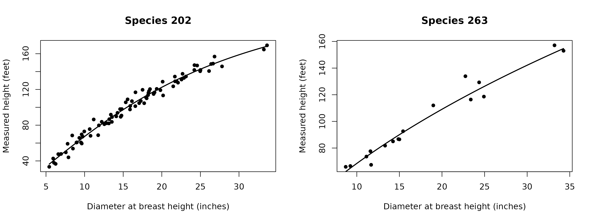

# Heights

Height fitting supplies missing total heights while preserving measured
heights for subsequent stem calculations.
[`fit_height()`](https://siskiyoubiometrics.com/merchandiser/reference/fit_height.md)
fits a relationship to diameter and species, with optional group
adjustments for plots or other sampling groups. Diameters enter in
inches, and measured and predicted heights use feet.

The Pacific Northwest example includes measured heights and stored
predictions. Replacing only its predicted heights creates the same
fitting inputs used to prepare the shipped list. The plot grouping must
also match to reproduce those predictions.

## Which heights were measured?

``` r

## Attach the calculation and data tools
library(merchandiser)
library(dplyr)
```

``` r

## Retain measurements and remove stored predictions before fitting
trees <- example_trees_pnw %>%
  mutate(ht_observed = if_else(ht_status == 'predicted', NA_real_, ht))
```

| ht_status | trees (count) |
|:----------|--------------:|
| measured  |           100 |
| predicted |           200 |

The list contains 100 measured heights, which supply the observations
for fitting. Missing heights are prediction targets rather than
observations used in the fit.

## How is the relationship fitted?

The default Chapman-Richards form is fitted with a pooled relationship
and species relationships where enough observations are available.
`min_n` controls the minimum sample for a species fit. Species fits that
cannot be estimated fall back to the pooled relationship, and the fitted
object records those choices.

``` r

## Refit using the same plot groups as the shipped predictions
height_fit <- fit_height(dbh = trees$dbh,
                         ht = trees$ht_observed,
                         spcd = trees$spcd,
                         group = trees$plot)
#> Warning: fit_height(): 200 rows with missing or nonfinite dbh, ht, spcd, or
#> group were omitted.
```

The warning reports omitted rows because the deliberately blanked
heights cannot contribute observations to fitting.

Measured heights used by the fit

| diameter (inches) | height (feet) | species code | group  |
|------------------:|--------------:|-------------:|:-------|
|             25.01 |         141.8 |          202 | PNW-01 |
|              6.71 |          47.3 |          202 | PNW-04 |
|             14.82 |          98.0 |          202 | PNW-07 |
|              6.04 |          37.9 |          202 | PNW-10 |
|              7.80 |          59.2 |          202 | PNW-03 |
|             24.21 |         141.8 |          202 | PNW-06 |
|             15.57 |         108.9 |          202 | PNW-09 |
|             18.94 |         114.9 |          202 | PNW-02 |
|             22.75 |         133.9 |          263 | PNW-05 |
|             15.00 |          86.5 |          263 | PNW-08 |
|             33.22 |         164.7 |          202 | PNW-01 |
|             17.95 |         111.2 |          202 | PNW-04 |
|             18.27 |         116.2 |          202 | PNW-07 |
|             14.68 |          89.4 |          202 | PNW-10 |
|             13.32 |          81.8 |          263 | PNW-03 |
|             12.87 |          82.2 |          202 | PNW-06 |
|              9.96 |          73.0 |          202 | PNW-09 |
|             18.47 |         120.4 |          202 | PNW-02 |
|             22.69 |         137.5 |          202 | PNW-05 |
|             17.07 |         104.7 |          202 | PNW-08 |
|              6.95 |          47.8 |          202 | PNW-01 |
|             17.28 |         107.1 |          202 | PNW-04 |
|             33.63 |         169.4 |          202 | PNW-07 |
|             26.83 |         156.8 |          202 | PNW-10 |
|             19.82 |         119.2 |          202 | PNW-03 |
|             17.51 |         119.6 |          202 | PNW-06 |
|              7.91 |          44.0 |          202 | PNW-09 |
|              7.57 |          49.6 |          202 | PNW-02 |
|             18.98 |         112.0 |          263 | PNW-05 |
|             24.36 |         129.3 |          263 | PNW-08 |
|              9.63 |          59.5 |          202 | PNW-01 |
|             11.13 |          73.6 |          263 | PNW-04 |
|              6.59 |          47.6 |          202 | PNW-07 |
|              9.00 |          60.8 |          202 | PNW-10 |
|              8.49 |          53.8 |          202 | PNW-03 |
|             14.26 |          93.8 |          202 | PNW-06 |
|             11.68 |          67.4 |          263 | PNW-09 |
|             13.40 |          91.8 |          202 | PNW-02 |
|              8.95 |          60.6 |          202 | PNW-05 |
|              9.53 |          60.7 |          202 | PNW-08 |
|             14.25 |          85.0 |          263 | PNW-01 |
|             11.76 |          68.8 |          202 | PNW-04 |
|              6.25 |          36.7 |          202 | PNW-07 |
|             17.72 |         104.6 |          202 | PNW-10 |
|             24.92 |         118.6 |          263 | PNW-03 |
|             21.69 |         134.4 |          202 | PNW-06 |
|              9.62 |          69.7 |          202 | PNW-09 |
|             13.20 |          86.7 |          202 | PNW-02 |
|              5.42 |          33.4 |          202 | PNW-05 |
|             26.39 |         148.5 |          202 | PNW-08 |
|             15.88 |          97.6 |          202 | PNW-01 |
|             16.13 |         106.9 |          202 | PNW-04 |
|             16.59 |         116.8 |          202 | PNW-07 |
|             11.60 |          77.6 |          263 | PNW-10 |
|             15.91 |         101.5 |          202 | PNW-03 |
|             11.18 |          86.4 |          202 | PNW-06 |
|             13.14 |          82.0 |          202 | PNW-09 |
|              8.70 |          65.9 |          263 | PNW-02 |
|             24.97 |         140.4 |          202 | PNW-05 |
|              9.24 |          66.5 |          263 | PNW-08 |
|              9.75 |          67.2 |          202 | PNW-01 |
|             12.56 |          81.1 |          202 | PNW-04 |
|             18.22 |         113.7 |          202 | PNW-07 |
|             14.10 |          89.9 |          202 | PNW-10 |
|             11.85 |          79.8 |          202 | PNW-03 |
|             21.48 |         123.5 |          202 | PNW-06 |
|             21.72 |         129.1 |          202 | PNW-09 |
|             19.34 |         120.6 |          202 | PNW-02 |
|             26.12 |         140.6 |          202 | PNW-05 |
|             22.10 |         127.6 |          202 | PNW-08 |
|             23.13 |         134.5 |          202 | PNW-01 |
|             15.43 |          92.6 |          263 | PNW-04 |
|              8.40 |          68.5 |          202 | PNW-07 |
|             34.27 |         153.0 |          263 | PNW-10 |
|             14.88 |          86.7 |          263 | PNW-03 |
|              5.93 |          42.7 |          202 | PNW-06 |
|             24.58 |         146.8 |          202 | PNW-09 |
|             20.11 |         128.7 |          202 | PNW-02 |
|             22.87 |         132.9 |          202 | PNW-05 |
|             26.64 |         148.9 |          202 | PNW-08 |
|             23.38 |         116.4 |          263 | PNW-01 |
|             24.23 |         147.2 |          202 | PNW-04 |
|             10.66 |          75.6 |          202 | PNW-07 |
|             20.17 |         113.3 |          202 | PNW-10 |
|             10.77 |          68.1 |          202 | PNW-03 |
|              9.32 |          65.8 |          202 | PNW-06 |
|             12.22 |          83.8 |          202 | PNW-09 |
|             14.78 |          90.8 |          202 | PNW-02 |
|             18.04 |         110.1 |          202 | PNW-05 |
|             22.55 |         131.1 |          202 | PNW-08 |
|             18.34 |         118.1 |          202 | PNW-01 |
|             21.93 |         129.0 |          202 | PNW-04 |
|             14.60 |          98.0 |          202 | PNW-07 |
|             27.80 |         145.8 |          202 | PNW-10 |
|             15.33 |         105.6 |          202 | PNW-03 |
|             13.53 |          83.7 |          202 | PNW-06 |
|             13.55 |          89.1 |          202 | PNW-09 |
|             33.21 |         157.1 |          263 | PNW-02 |
|             19.06 |         116.7 |          202 | PNW-05 |
|             16.57 |         101.3 |          202 | PNW-08 |

These are the 100 measured rows retained for the fitted curves.



The fit uses 100 retained observations, shown against the fitted
diameter-height relationships. The plot displays the data used by the
model, so missing height rows are absent.

The available forms are Chapman-Richards, Curtis, Wykoff, Näslund, and
Schumacher. The chosen form remains part of the fitted object. Group
adjustments describe shared departures within the supplied groups, and
do not replace the species relationship.

The fitted object retains the observations, species sample counts, fixed
coefficients, variance components, and group effects. These records
distinguish a separately fitted species relationship from one using the
pooled model.

## Do the completed heights match?

[`complete_heights()`](https://siskiyoubiometrics.com/merchandiser/reference/complete_heights.md)
preserves measured heights on rows with valid diameter, height, and
species inputs, and fills nonfinite heights using the supplied fit. An
invalid diameter or species code can also replace a finite measured
height with a missing value and a warning. Passing the existing fit
avoids fitting again when completing another list from the same sampling
groups.

``` r

## Fill missing heights with conditional plot predictions
trees <- trees %>%
  mutate(ht_completed = complete_heights(dbh = dbh,
                                         ht = ht_observed,
                                         spcd = spcd,
                                         group = plot,
                                         fit = height_fit))
```

``` r

## Compare completed heights with the original stored values
comparison <- trees %>%
  group_by(ht_status) %>%
  summarize(trees = n(), max_difference = max(abs(ht_completed - ht)))
```

| ht_status | trees (count) | maximum difference (feet) |
|:----------|--------------:|--------------------------:|
| measured  |           100 |                         0 |
| predicted |           200 |                         0 |

The maximum difference is 0 feet, confirming that the refitted,
plot-adjusted predictions reproduce the shipped heights to the displayed
precision.

Completing the heights does not alter diameter, species, or plot
identifiers.

## What do the prediction intervals include?

[`predict_height()`](https://siskiyoubiometrics.com/merchandiser/reference/predict_height.md)
uses conditional group adjustments by default. An absent or unseen group
uses the population relationship, while `re_form = 'population'`
requests population predictions explicitly. A species absent from the
fitted species mapping returns a missing prediction with a warning.

Prediction intervals simulate group variation and residual error around
the fitted relationship. For a known group, simulation centers its
adjustment on the fitted group effect. The intervals hold fitted
coefficients fixed, exclude coefficient uncertainty and inventory
sampling uncertainty, and constrain their lower endpoints to breast
height. They describe height predictions under the fitted model rather
than uncertainty in an inventory total.

``` r

## Select prediction targets for an interval comparison
targets <- trees %>%
  filter(ht_status == 'predicted') %>%
  slice_head(n = 4)
```

``` r

## Predict heights and repeatable intervals for the selected plots
intervals <- predict_height(fit = height_fit,
                            dbh = targets$dbh,
                            spcd = targets$spcd,
                            group = targets$plot,
                            interval = TRUE,
                            seed = 12)
```

| tree_id | fit (feet) | lower (feet) | upper (feet) |
|--------:|-----------:|-------------:|-------------:|
|       2 |     70.229 |       61.224 |       78.791 |
|       3 |     81.273 |       71.668 |       90.101 |
|       5 |    173.681 |      156.561 |      192.661 |
|       6 |     67.614 |       59.521 |       76.435 |

The first target has a conditional height estimate of 70.229 feet.
