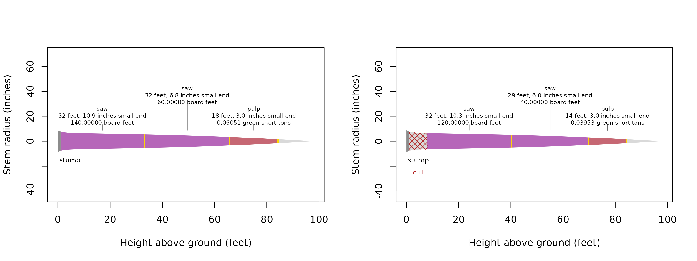

# Recording defect

Located defects change which stem sections
[`merchandise()`](https://siskiyoubiometrics.com/merchandiser/reference/merchandise.md)
can use and which products can occupy them. Record these when a defect
has a known position along the stem, using heights in feet above ground.
A defect row belongs to a tree identifier and describes an interval or
an ending height, rather than a deduction from the final scale.

## What does each effect do?

A cull removes its interval from cutting. An end stops the usable stem
at its starting height. A restriction allows only its named product
within the interval, and a sweep compares its percentage with each
product’s `max_sweep`. None of these effects applies a percentage
deduction to log scale.

``` r

## Attach the calculation and data tools
library(merchandiser)
library(dplyr)
```

``` r

## Remove a known section from this example tree
cull <- defect(tree_id = example_trees$tree_id[1],
               start_height = 1,
               end_height = 8,
               effect = 'cull')

## End the usable stem at a measured height
end <- defect(tree_id = example_trees$tree_id[1],
              start_height = 40,
              end_height = NA,
              effect = 'end')
```

``` r

## Allow only pulp above the restriction's starting height
restricted <- defect(tree_id = example_trees$tree_id[1],
                     start_height = 30,
                     end_height = NA,
                     effect = 'restrict',
                     product = 'pulp')
```

``` r

## Compare sweep severity with product acceptance limits
sweep <- defect(tree_id = example_trees$tree_id[1],
                start_height = 20,
                end_height = 35,
                effect = 'sweep',
                percent = 25)
```

| tree_id | start (feet) | end (feet) | effect   | product | severity (percent) |
|--------:|-------------:|-----------:|:---------|:--------|-------------------:|
|       1 |            1 |          8 | cull     | NA      |                 NA |
|       1 |           40 |         NA | end      | NA      |                 NA |
|       1 |           30 |         NA | restrict | pulp    |                 NA |
|       1 |           20 |         35 | sweep    | NA      |                 25 |

The cull ends at 8 feet, and its recorded interval is unavailable to
every product.

Missing interval ends extend to the tree tip for cull, restriction, and
sweep records. An end record uses its starting height alone.
Restrictions require an exact product name, and percentages belong only
to sweep records. The constructor checks field types, while validation
checks their relationships to the trees and products.

## What changed with the defects?

The shipped Pacific Northwest defects include each effect. The
comparison below selects a tree with a butt cull and passes its matching
record explicitly. Both calculations use the same measurements and
specifications, so differences follow from the available stem sections.

``` r

## Assign sawlog dimensions and a sweep limit
saw <- product(product = 'saw',  ## product label
               min_length = 16,  ## feet
               max_length = 32,  ## feet
               trim = 0.5,  ## feet
               min_sed = 6,  ## inches inside bark
               max_sweep = 10,  ## percent
               volume_unit = 'scribner')  ## board feet

## Accept shorter and smaller sections as pulp
pulp <- product(product = 'pulp',  ## product label
                min_length = 8,  ## feet
                max_length = 20,  ## feet
                trim = 0.5,  ## feet
                min_sed = 3,  ## inches inside bark
                volume_unit = 'green_ton')  ## green short tons
```

The saw product precedes pulp in
[`products()`](https://siskiyoubiometrics.com/merchandiser/reference/products.md),
giving it cutting priority in both calculations.

``` r

## Select the tree and its located defects
tree <- example_trees_pnw %>%
  filter(tree_id == 7)

## Keep records for that tree
located <- example_defects_pnw %>%
  filter(tree_id == 7)

## Set sawlog priority ahead of pulp
specifications <- products(saw, pulp)
```

``` r

## Select logs without located defects
clean <- merchandise(tree_id = tree$tree_id,
                     dbh = tree$dbh,
                     ht = tree$ht,
                     spcd = tree$spcd,
                     products = specifications)
```

``` r

## Select logs with the recorded cull
affected <- merchandise(tree_id = tree$tree_id,
                        dbh = tree$dbh,
                        ht = tree$ht,
                        spcd = tree$spcd,
                        products = specifications,
                        defects = located)
```

| condition | product | start (feet) | end (feet) | length (feet) | small-end diameter (inches) | scale (Scribner board feet) | scale (green short tons) |
|:---|:---|---:|---:|---:|---:|---:|---:|
| clean | saw | 1.0 | 33.5 | 32 | 10.895 | 140 | NA |
| clean | saw | 33.5 | 66.0 | 32 | 6.753 | 60 | NA |
| clean | pulp | 66.0 | 84.5 | 18 | 3.017 | NA | 0.061 |
| affected | saw | 8.0 | 40.5 | 32 | 10.258 | 120 | NA |
| affected | saw | 40.5 | 70.0 | 29 | 6.019 | 40 | NA |
| affected | pulp | 70.0 | 84.5 | 14 | 3.017 | NA | 0.040 |

The affected calculation starts its first log at 8 feet, which moves the
base of the selected wood in the drawing.

``` r

## Compare cuts with and without the recorded cull
par(mfrow = c(1, 2))
plot(clean)
plot(affected)
```



The affected stem begins cutting at 8 feet, above the recorded butt
cull. The same product colors identify corresponding products in both
drawings.

| tree_id | start (feet) | end (feet) | cause |
|--------:|-------------:|-----------:|:------|
|       7 |            1 |          8 | cull  |

The cull residual ends at 8 feet, matching the upper boundary in the
defect record.

When merchandising a subset of trees, filter defect records to the same
identifiers. The calculation warns and drops records for trees absent
from that call before checking the remaining records. Retaining matching
identifiers avoids carrying unrelated defect warnings into a comparison
of product specifications.

## How do stopper columns become defects?

[`defects_from_stoppers()`](https://siskiyoubiometrics.com/merchandiser/reference/defects_from_stoppers.md)
converts a saw stop to a restriction, a pulp stop to an end, and a jump
butt to a cull above the stump. Stops must occur in their physical order
and remain within the tree. Missing stop heights add no record. A whole
pulp tree can be identified with `pulp_tree`, without also supplying a
saw stop or jump butt.

``` r

## Convert the southern list's recorded stopping heights
stoppers <- defects_from_stoppers(tree_id = example_trees_south$tree_id,
                                  ht = example_trees_south$ht,
                                  topwood_product = 'pulp',
                                  saw_stop = example_trees_south$saw_stop,
                                  pulp_stop = example_trees_south$pulp_stop,
                                  jump_butt = example_trees_south$jump_butt)
```

| effect   | records (count) |
|:---------|----------------:|
| cull     |               1 |
| end      |              32 |
| restrict |              60 |

The conversion creates 60 restriction records from the southern saw
stops.

## How is a percentage by thirds combined?

[`defect_by_thirds()`](https://siskiyoubiometrics.com/merchandiser/reference/defect_by_thirds.md)
weights the recorded percentages by inside bark volume in the lower,
middle, and upper thirds of total height. It returns a whole-tree
percentage for use in a separate calculation. A subsequent calculation
can apply the returned percentage to a specified quantity.
[`merchandise()`](https://siskiyoubiometrics.com/merchandiser/reference/merchandise.md)
does not apply this percentage.

``` r

## Weight the recorded percentages by stem volume in each third
thirds <- defect_by_thirds(dbh = tree$dbh,
                           ht = tree$ht,
                           spcd = tree$spcd,
                           lower = 10,
                           middle = 5,
                           upper = 0)
```

| whole-tree defect (percent) | status |
|----------------------------:|-------:|
|                       7.693 |      0 |

The volume-weighted estimate is 7.693 percent for this tree’s thirds.

The percentage result has its own status column. A missing percentage in
any third prevents a complete weighted estimate, rather than treating
the missing entry as an absence of defect. Retain that status with any
later deduction.

## Are the records consistent?

``` r

## Validate heights and product names before cutting
checked <- validate_defects(defects = located,
                            tree_id = tree$tree_id,
                            ht = tree$ht,
                            products = specifications)
```

| tree_id | start (feet) | end (feet) | effect | product | sweep (percent) | status |
|--------:|-------------:|-----------:|:-------|:--------|----------------:|-------:|
|       7 |            1 |          8 | cull   | NA      |              NA |      0 |

The record has status 0, indicating valid heights and an accepted
effect. Validation also removes duplicate records and merges overlapping
valid culls.
