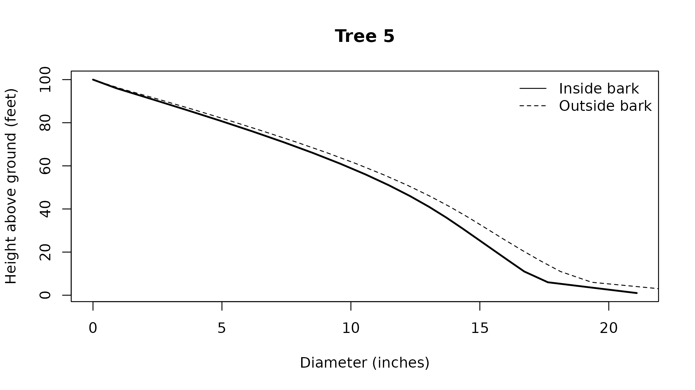

# Stem measurements and volumes

Stem calculations measure diameters, locate diameter limits, and
integrate volume between specified points on a tree. Use them to inspect
the taper underlying a product calculation or measure a section without
selecting logs. Diameters enter and return in inches, heights use feet,
and solid volume returns in cubic feet.

## What does the selected profile look like?

[`stem_profile()`](https://siskiyoubiometrics.com/merchandiser/reference/stem_profile.md)
samples each tree between requested bounds and includes the ending
height. The default lower bound is the stump, and the default upper
bound is the tip. Each row retains `tree_id`, its measurement height,
both bark diameters, cumulative volumes from the lower bound, and
status.

``` r

## Attach the calculation and data tools
library(merchandiser)
library(dplyr)
```

``` r

## Select the tree with a stored taper equation
tree <- example_trees %>%
  filter(tree_id == 5)
```

``` r

## Sample the stored equation along this tree
profile <- stem_profile(tree_id = tree$tree_id,
                        dbh = tree$dbh,
                        ht = tree$ht,
                        spcd = tree$spcd,
                        model = tree$model,
                        step = 5)
```

Sampled profile values

| tree_id | height (feet) | inside diameter (inches) | outside diameter (inches) | inside volume (cubic feet) | outside volume (cubic feet) | status |
|---:|---:|---:|---:|---:|---:|---:|
| 5 | 1 | 21.085 | 23.711 | 0.000 | 0.000 | 0 |
| 5 | 6 | 17.639 | 19.343 | 10.093 | 11.933 | 0 |
| 5 | 11 | 16.723 | 18.126 | 18.141 | 21.430 | 0 |
| 5 | 16 | 16.117 | 17.341 | 25.501 | 29.999 | 0 |
| 5 | 21 | 15.519 | 16.615 | 32.326 | 37.858 | 0 |
| 5 | 26 | 14.921 | 15.920 | 38.645 | 45.074 | 0 |
| 5 | 31 | 14.322 | 15.247 | 44.477 | 51.696 | 0 |
| 5 | 36 | 13.702 | 14.566 | 49.834 | 57.759 | 0 |
| 5 | 41 | 13.031 | 13.843 | 54.710 | 63.266 | 0 |
| 5 | 46 | 12.291 | 13.055 | 59.086 | 68.205 | 0 |
| 5 | 51 | 11.472 | 12.190 | 62.940 | 72.556 | 0 |
| 5 | 56 | 10.572 | 11.242 | 66.259 | 76.306 | 0 |
| 5 | 61 | 9.588 | 10.208 | 69.036 | 79.450 | 0 |
| 5 | 66 | 8.524 | 9.089 | 71.279 | 81.995 | 0 |
| 5 | 71 | 7.385 | 7.888 | 73.012 | 83.966 | 0 |
| 5 | 76 | 6.179 | 6.614 | 74.275 | 85.406 | 0 |
| 5 | 81 | 4.916 | 5.292 | 75.124 | 86.378 | 0 |
| 5 | 86 | 3.607 | 3.924 | 75.627 | 86.962 | 0 |
| 5 | 91 | 2.265 | 2.504 | 75.871 | 87.249 | 0 |
| 5 | 96 | 0.905 | 1.022 | 75.949 | 87.339 | 0 |
| 5 | 100 | 0.000 | 0.000 | 75.958 | 87.346 | 0 |

The final profile row reaches 100 feet, the supplied total height.

``` r

## Draw inside and outside bark stem diameters
plot(profile)
```



The final profile row reaches 100 feet, matching the endpoint in the
drawing. Solid and dashed lines distinguish inside and outside bark
diameters.

## What is the diameter at a specified height?

[`dib()`](https://siskiyoubiometrics.com/merchandiser/reference/dib.md)
and
[`dob()`](https://siskiyoubiometrics.com/merchandiser/reference/dob.md)
evaluate the selected equation at a height above ground. Their result
contains one value and one status for each input tree. They retain input
order but do not add identifiers, so attach the measurements to the
original tree list when identifiers are needed.

``` r

## Measure inside bark diameter at the chosen height
inside <- dib(dbh = tree$dbh,
              ht = tree$ht,
              h = 20,
              spcd = tree$spcd,
              model = tree$model)
```

``` r

## Measure outside bark diameter at the same height
outside <- dob(dbh = tree$dbh,
               ht = tree$ht,
               h = 20,
               spcd = tree$spcd,
               model = tree$model)
```

| basis   | diameter (inches) | status |
|:--------|------------------:|-------:|
| inside  |            15.638 |      0 |
| outside |            16.757 |      0 |

The inside bark diameter is 15.638 inches at the requested height. An
equation without an outside bark capability needs a supported bark ratio
or returns a capability status.

## Where does the stem reach a diameter limit?

The inverse functions return the height corresponding to a target
diameter on the selected bark basis. Under the default compatibility
setting, a profile with multiple crossings returns the highest crossing
and reports the condition. Source compatibility can instead reproduce
the source inverse behavior described under [Taper
equations](https://siskiyoubiometrics.com/merchandiser/articles/taper-equations.md).
This matters when using a diameter limit to bound a section near a butt
irregularity.

``` r

## Locate the inside bark diameter measured above
inside_height <- height_at_dib(dbh = tree$dbh,
                               ht = tree$ht,
                               dib = inside$value,
                               spcd = tree$spcd,
                               model = tree$model)
```

``` r

## Locate the corresponding outside bark diameter
outside_height <- height_at_dob(dbh = tree$dbh,
                                ht = tree$ht,
                                dob = outside$value,
                                spcd = tree$spcd,
                                model = tree$model)
```

| basis   | height (feet) | status |
|:--------|--------------:|-------:|
| inside  |            20 |      0 |
| outside |            20 |      0 |

The inverse returns 20 feet for the inside bark diameter previously
calculated at that height.

## How much wood is in a section?

[`stem_volume()`](https://siskiyoubiometrics.com/merchandiser/reference/stem_volume.md)
accepts height or diameter bounds. Specify at most one lower bound and
one upper bound, using `from`, `from_dib`, or `from_dob` below and the
corresponding `to` argument above. Diameter bounds locate the section
independently of the bark basis used for its volume.

``` r

## Measure wood between explicit heights above ground
section <- stem_volume(dbh = tree$dbh,
                       ht = tree$ht,
                       spcd = tree$spcd,
                       model = tree$model,
                       from = 1,
                       to = 33,
                       inside_bark = TRUE)
```

| volume (cubic feet) | status |
|--------------------:|-------:|
|              46.677 |      0 |

The section contains 46.677 cubic feet inside bark. The lower bound must
remain below the upper bound for a usable section.

[`green_weight()`](https://siskiyoubiometrics.com/merchandiser/reference/green_weight.md)
converts solid volume to short tons using species wood and bark
properties. Its default stem component includes wood and attached bark.
`component` can instead select wood or bark, and `moisture` can request
dry mass. Explicit property inputs override the corresponding species
defaults. This is a merchandising weight calculation, not a carbon
calculation.

``` r

## Convert inside bark solid volume to green stem weight
weight <- green_weight(volume = section$value,
                       spcd = tree$spcd,
                       inside_bark = TRUE)
```

| green stem weight (short tons) | status |
|-------------------------------:|-------:|
|                          1.097 |      0 |

The section’s wood and attached bark weigh 1.097 green short tons under
the species defaults.

## Which taper equation is being used?

Leaving `model` unspecified selects the species default from
`default_taper_models`. An explicit model identifier takes precedence.
In
[`merchandise()`](https://siskiyoubiometrics.com/merchandiser/reference/merchandise.md),
a `taper_map` supplies unique `spcd` and `model` columns for custom
species assignments. A supplied map must cover the trees being
calculated, with no fallback for an omitted species. The map is
validated even when `model` is explicit.

``` r

## Inspect the stored model and confirm it can be resolved
selected_model <- get_taper_model(model = tree$model)

## Check whether the selected identifier is available
has_taper_model(model = selected_model$id)
#> [1] TRUE

## Inspect the identifier passed to the measurement calls
selected_model$id
#> [1] "F00FW2W202"
```

The stored identifier resolves to F00FW2W202, so it can be passed
directly to the stem functions. Availability alone does not check
species scope or required auxiliary measurements.

``` r

## List registered models for this species
models <- taper_models(spcd = tree$spcd)
```

| id         | form           | has_dob | has_inverse | has_integral |
|:-----------|:---------------|:--------|:------------|:-------------|
| 100FW2W202 | flewelling_2pt | TRUE    | FALSE       | TRUE         |
| 100JB2W202 | r1_taper       | FALSE   | TRUE        | TRUE         |
| 200CZ2W202 | r2_taper       | FALSE   | TRUE        | TRUE         |
| 200CZ3W202 | r2_taper       | FALSE   | TRUE        | TRUE         |
| 200FW2W202 | flewelling_2pt | TRUE    | FALSE       | TRUE         |

The first listed model is 100FW2W202. The capability columns indicate
whether the model supplies outside bark diameter, an inverse, and a
volume integral, with numerical fallbacks available for the latter two.

`species_reference` also records species names, wood density, and bark
ratios. Calculation calls use numeric species codes. A species default
is a stored equation assignment, not a fitted relationship inferred from
the submitted tree list.

Scalar inputs recycle to the number of trees. Other vector lengths must
agree.
[`merchandise()`](https://siskiyoubiometrics.com/merchandiser/reference/merchandise.md)
and
[`stem_profile()`](https://siskiyoubiometrics.com/merchandiser/reference/stem_profile.md)
require unique, nonmissing tree identifiers, while repeated measurement
rows in
[`fit_taper()`](https://siskiyoubiometrics.com/merchandiser/reference/fit_taper.md)
deliberately share identifiers. Invalid tree inputs retain their place
in vector calculations and receive a status rather than shifting the
remaining rows.

## Where is trim recorded?

A log occupies its nominal length plus trim, is scaled on its nominal
length, and leaves the trim wood in the residual record. This separates
the occupied stem interval from the wood included in the product scale.

``` r

## Define a nominal log with a separate trim allowance
saw <- product(product = 'saw',  ## product label
               min_length = 32,  ## feet
               max_length = 32,  ## feet
               trim = 0.5,  ## feet
               min_sed = 12,  ## inches inside bark
               volume_unit = 'cubic')  ## cubic feet
```

``` r

## Select nominal logs and retain their trim residuals
result <- merchandise(tree_id = tree$tree_id,
                      dbh = tree$dbh,
                      ht = tree$ht,
                      spcd = tree$spcd,
                      products = saw,
                      model = tree$model)
```

| tree_id | start (feet) | end (feet) | cause |
|--------:|-------------:|-----------:|:------|
|       5 |           33 |       33.5 | trim  |

The first trim interval ends at 33.5 feet above ground, beyond the
nominal body. It is not included in that log’s cubic scale.

## How can a species map be retained?

A map keeps chosen assignments beside the script without adding the same
identifier separately to every call. Use the stored example assignments
to build a map, then inspect the equation rows recorded with the result.

``` r

## Build one equation assignment per species
mapping <- example_trees %>%
  distinct(spcd, model)
```

``` r

## Apply the retained assignments to the example tree
mapped <- merchandise(tree_id = tree$tree_id,
                      dbh = tree$dbh,
                      ht = tree$ht,
                      spcd = tree$spcd,
                      products = saw,
                      taper_map = mapping)
```

| tree_id | spcd | model      | source          |
|--------:|-----:|:-----------|:----------------|
|       5 |  202 | F00FW2W202 | species_default |

The mapped tree uses F00FW2W202, matching the stored assignment. The
recorded source label is `species_default` for this map-based selection,
while an explicit `model` records `caller_model`.
