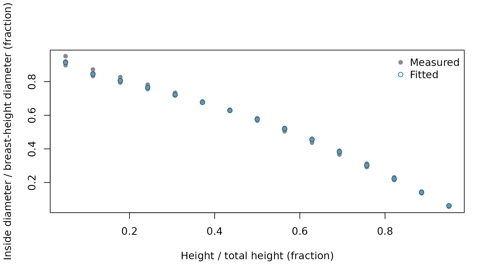

# Taper equations

Taper equations supply the diameter profiles and section measurements
used by merchandising. Select a shipped equation when its species scope
and required inputs fit the tree measurements, or fit coefficients to
measured stems when a local relationship is needed. Public tree
measurements use inches and feet, including calls that evaluate a fitted
equation stored on a metric coefficient scale.

## Which equation families ship?

The shipped source equations come from the Forest Service National
Volume Estimator Library. The source inventory records the files
contributing each family, including the supporting routines used to
select equations and measure profiles. Availability is determined by the
implemented equation and its required measurements, rather than by the
identifier’s appearance alone.

| family | source_files |
|:---|:---|
| Flewelling variable-shape profiles | f_west.f, f_ingy.f, f_alaska.f, f_other.f, sf_2pt.f, sf_2pth.f, sf_3pt.f, sf_3z.f, sf_corr.f, sf_dfz.f, sf_ds.f, sf_hs.f, sf_shp.f, sf_taper.f, sf_yhat.f, sf_yhat3.f, sf_zero.f |
| Clark source profiles | r8clkdib.f, r8dib.f, r8dib.inc, r8clkcoef.inc, r8cfo.inc, r8clist.inc, r8vlist.f, r8vlist.inc, r8init.f, r8prep.f, r8vol.f, r8vol1.f, r8vol2.f, r9clarkdib.f, r9clark.f, r9coeff.inc, r9init.f, r9vol.f, r9logs.f, clkcoef_mod.f, calcdia.f, ht2topd.f, profile.f, volinit.f, voleqdef.f |
| Alaska and Mathis source profiles | r10tap.f, r10tapo.f, r10d2h.f, r10vol.f, r10vol1.f, r10volo.f, r4d2h.f, r4vol.f, profile.f, calcdia.f, ht2topd.f |
| Smaller source profile families | r1tap.f, r2tap.f, r5tap.f, r12tap.f, stump.f, blmtap.f, blmvol.f, formclas.f, r6vol3.f |
| National scale volume and biomass profiles | nsvb.f, tables1.inc through tables11.inc, dist_ecoprov.inc, regndftdata.inc, scrib.f |
| Identifier and merchandising support | voleqdef.f, fiaeq2nveleq.for, mrules.f |

The identifier and merchandising support family draws on voleqdef.f,
fiaeq2nveleq.for, mrules.f, the source files listed for equation
selection and cutting rules.

Source identifiers have family-specific field layouts. The following
table separates an identifier stored with the example trees and a
national identifier into their actual fields. Treat these as recorded
identifiers, not names to edit when changing a species assignment.

| layout         | field                         | positions | value |
|:---------------|:------------------------------|:----------|:------|
| source profile | geographic equation selection | 1:3       | F00   |
| source profile | equation mnemonic             | 4:6       | FW2   |
| source profile | family-specific variant       | 7         | W     |
| source profile | species suffix                | 8:10      | 202   |
| national scale | system marker                 | 1:3       | NVB   |
| national scale | mountain indicator or zero    | 4         | 0     |
| national scale | ecological division           | 5:7       | 210   |
| national scale | species suffix                | 8:10      | 202   |

The stored profile’s species suffix is 202, matching the species code in
that identifier. The national identifier NVB0210202 combines the system
marker, mountain indicator, ecological division, and species suffix
shown in the table.

## Which compatibility behavior is used?

The default `port` setting follows the public profile and the calculated
quantities where source routines have inconsistent branches or
unassigned outputs. The `nvel` setting reproduces the listed source
behavior. This option is separate from choosing a taper equation, and
affects the specific calculations in the comparison table.

``` r

## Attach the calculation and data tools
library(merchandiser)
library(dplyr)
```

``` r

## Inspect the active compatibility choice
getOption(x = 'merchandiser.compat', default = 'port')
#> [1] "port"
```

| area | port | nvel |
|:---|:---|:---|
| Inventory-code geographic substitution (fiaeq2nveleq.for) | applies the intended trimmed geographic substitutions | reproduces fixed-width source string semantics |
| Flewelling SF_HS inverse | inverts the displayed profile and selects its highest crossing | reproduces the source bark-height argument and crossing selection |
| Clark 834CLKE110 inverse | returns the highest actual crossing | reproduces the source two-root addition |
| Clark R9LOGS error 12 | retains a computable total in the internal volume record | reproduces the source error and cleared record |
| R10 height selection and cedar equality | inverts the registered profile consistently | retains source height results and the cedar equality rule |
| Smaller-family inverse search | returns the precise numeric crossing | reproduces the source rounded search |
| R12 height selection | inverts the public profile | retains the source result for an unselected calculation |
| National scale CALCDIA outside-bark diameter | returns the outside-bark diameter computed internally | reproduces the unassigned source output slot |
| National scale Table S10 carbon fraction | returns the fraction used by the biomass calculation | returns the raw source-table fraction |

The Clark inverse entry selects the highest actual crossing in `port`,
while `nvel` reproduces the source’s addition of two roots. The
distinction affects the height returned for that source profile, rather
than its species assignment.

## How closely does the package match the pinned source?

The agreement table compares saved single and double precision source
results with package calculations. Each row reports the comparison
count, the number within tolerance, the largest relative difference, and
the count of excluded rows. These tolerances apply to the specified
output and compatibility setting, not to every equation as a single
blanket accuracy claim.

``` r

## Identify the source revision used for agreement fixtures
nvel_source_revision()
#> [1] "38548071d5aa652bb90c7f111f86b427f798a1c9"
#> attr(,"upstream_url")
#> [1] "https://github.com/FMSC-Measurements/VolumeLibrary"
#> attr(,"fixtures_release_tag")
#> [1] "v0.1.0"
```

| precision | compat |
|:----------|:-------|
| double    | nvel   |
| double    | port   |
| single    | nvel   |
| single    | port   |

The `double` entries retain both compatibility settings, so precision
alone does not identify the calculation being compared.

Excluded rows and their reasons are listed in
`inst/extdata/oracle-agreement.csv`, shipped with the package.

| family | output | precision | compat | rows compared (count) | rows within tolerance (count) | maximum relative difference (ratio) | tolerance (ratio) | excluded rows (count) |
|:---|:---|:---|:---|---:|---:|:---|:---|---:|
| behre_taper | diameter inside bark | double | port | 1780 | 1780 | 2.91e-16 | 2.00e-12 | 0 |
| behre_taper | diameter inside bark | single | port | 1780 | 1780 | 1.74e-07 | 3.00e-04 | 0 |
| behre_taper | height at inside bark diameter | double | nvel | 1323 | 1323 | 0.00e+00 | 4.00e-05 | 214 |
| behre_taper | height at inside bark diameter | single | nvel | 1323 | 1323 | 4.83e-08 | 2.00e-03 | 214 |
| blm_taper | diameter inside bark | double | port | 30106 | 30106 | 3.53e-16 | 2.00e-12 | 0 |
| blm_taper | diameter inside bark | single | port | 30106 | 30106 | 2.01e-07 | 3.00e-04 | 0 |
| blm_taper | height at inside bark diameter | double | nvel | 22683 | 22683 | 0.00e+00 | 4.00e-05 | 3441 |
| blm_taper | height at inside bark diameter | single | nvel | 22683 | 22683 | 4.83e-08 | 2.00e-03 | 3441 |
| clark_r8 | diameter inside bark | double | port | 1478303 | 1478303 | 1.11e-14 | 2.00e-04 | 526422 |
| clark_r8 | diameter inside bark | single | port | 1478303 | 1478303 | 9.08e-05 | 3.00e-04 | 526422 |
| clark_r8 | height at inside bark diameter | double | nvel | 4 | 4 | 0.00e+00 | 4.00e-05 | 1739061 |
| clark_r8 | height at inside bark diameter | single | nvel | 4 | 4 | 1.50e-06 | 2.00e-03 | 1739061 |
| clark_r8 | height at inside bark diameter | double | port | 1163439 | 1163439 | 2.20e-15 | 4.00e-05 | 575626 |
| clark_r8 | height at inside bark diameter | single | port | 1163439 | 1163439 | 1.34e-04 | 2.00e-03 | 575626 |
| clark_r8 | stump cubic volume | double | port | 600721 | 600721 | 7.98e-16 | 1.00e-12 | 268935 |
| clark_r8 | stump cubic volume | single | port | 600738 | 600738 | 1.84e-03 | 2.00e-03 | 268918 |
| clark_r8 | total cubic volume | double | port | 652388 | 652388 | 0.00e+00 | 1.00e-12 | 217268 |
| clark_r8 | total cubic volume | single | port | 652388 | 652388 | 0.00e+00 | 2.00e-03 | 217268 |
| clark_r9 | diameter inside bark | double | port | 621260 | 621260 | 4.03e-16 | 2.00e-04 | 0 |
| clark_r9 | diameter inside bark | single | port | 621249 | 621249 | 2.75e-04 | 3.00e-04 | 11 |
| clark_r9 | height at inside bark diameter | double | port | 539010 | 539010 | 2.72e-15 | 4.00e-05 | 17 |
| clark_r9 | height at inside bark diameter | single | port | 539010 | 539010 | 7.61e-05 | 2.00e-03 | 17 |
| clark_r9 | R9LOGS error 12 | double | nvel | 7262 | 7262 | 0.00e+00 | 0.00e+00 | 262156 |
| clark_r9 | R9LOGS error 12 | single | nvel | 7262 | 7262 | 0.00e+00 | 0.00e+00 | 262156 |
| clark_r9 | stump cubic volume | double | port | 262156 | 262156 | 2.11e-15 | 1.00e-12 | 7262 |
| clark_r9 | stump cubic volume | single | port | 261766 | 261766 | 5.40e-04 | 2.00e-03 | 7652 |
| clark_r9 | total cubic volume | double | port | 262156 | 262156 | 0.00e+00 | 1.00e-12 | 7262 |
| clark_r9 | total cubic volume | single | port | 262133 | 262133 | 1.48e-03 | 2.00e-03 | 7285 |
| FIAEQ2NVELEQ | short geographic substitution | double | nvel | 5 | 5 | 0.00e+00 | 0.00e+00 | 0 |
| flewelling_2pt | diameter inside bark | double | port | 128415 | 128415 | 1.95e-13 | 2.00e-04 | 7968 |
| flewelling_2pt | diameter inside bark | single | port | 128415 | 128415 | 2.00e-04 | 3.00e-04 | 7968 |
| flewelling_2pt | diameter outside bark | double | port | 128415 | 128415 | 1.50e-04 | 2.00e-04 | 7968 |
| flewelling_2pt | diameter outside bark | single | port | 128415 | 128415 | 1.85e-04 | 3.00e-04 | 7968 |
| flewelling_2pt | height at inside bark diameter | double | nvel | 11525 | 11525 | 1.00e-08 | 4.00e-05 | 106776 |
| flewelling_2pt | height at inside bark diameter | single | nvel | 11520 | 11520 | 1.88e-03 | 2.00e-03 | 106781 |
| flewelling_2pt | height at inside bark diameter | double | port | 99822 | 99822 | 2.18e-05 | 4.00e-05 | 18479 |
| flewelling_2pt | height at inside bark diameter | single | port | 99822 | 99822 | 1.26e-03 | 2.00e-03 | 18479 |
| flewelling_2pt | stump cubic volume | double | port | 14416 | 14416 | 2.59e-15 | 1.00e-12 | 1090 |
| flewelling_2pt | stump cubic volume | single | port | 14416 | 14416 | 3.58e-05 | 2.00e-03 | 1090 |
| flewelling_2pt | total cubic volume | double | port | 14416 | 14416 | 2.22e-16 | 1.00e-12 | 1090 |
| flewelling_2pt | total cubic volume | single | port | 14416 | 14416 | 3.55e-04 | 2.00e-03 | 1090 |
| flewelling_3pt | diameter inside bark | double | port | 37616 | 37616 | 2.08e-16 | 2.00e-04 | 2300 |
| flewelling_3pt | diameter inside bark | single | port | 37616 | 37616 | 1.06e-04 | 3.00e-04 | 2300 |
| flewelling_3pt | diameter outside bark | double | port | 37616 | 37616 | 0.00e+00 | 2.00e-04 | 2300 |
| flewelling_3pt | diameter outside bark | single | port | 37616 | 37616 | 0.00e+00 | 3.00e-04 | 2300 |
| flewelling_3pt | height at inside bark diameter | double | nvel | 23082 | 23082 | 3.73e-12 | 4.00e-05 | 11523 |
| flewelling_3pt | height at inside bark diameter | single | nvel | 23074 | 23074 | 1.75e-03 | 2.00e-03 | 11531 |
| flewelling_3pt | height at inside bark diameter | double | port | 6930 | 6930 | 7.92e-06 | 4.00e-05 | 27675 |
| flewelling_3pt | height at inside bark diameter | single | port | 6930 | 6930 | 1.26e-03 | 2.00e-03 | 27675 |
| flewelling_3pt | stump cubic volume | double | port | 3964 | 3964 | 1.04e-17 | 1.00e-12 | 0 |
| flewelling_3pt | stump cubic volume | single | port | 3964 | 3964 | 2.56e-05 | 2.00e-03 | 0 |
| flewelling_3pt | total cubic volume | double | port | 3964 | 3964 | 2.22e-16 | 1.00e-12 | 601 |
| flewelling_3pt | total cubic volume | single | port | 3964 | 3964 | 1.75e-03 | 2.00e-03 | 601 |
| nsvb | biomass, 30 values per row | double | port | 2936 | 2936 | 1.84e-14 | 2.00e-12 | 0 |
| nsvb | biomass, 30 values per row | single | port | 2936 | 2936 | 9.62e-04 | 1.00e-03 | 0 |
| nsvb | carbon fraction | double | nvel | 1 | 1 | 0.00e+00 | 0.00e+00 | 0 |
| nsvb | diameter inside bark | double | port | 26755 | 26755 | 0.00e+00 | 2.00e-04 | 0 |
| nsvb | diameter inside bark | single | port | 26755 | 26755 | 5.86e-07 | 3.00e-04 | 0 |
| nsvb | diameter outside bark | double | nvel | 26755 | 26755 | 0.00e+00 | 0.00e+00 | 0 |
| nsvb | diameter outside bark | single | nvel | 26755 | 26755 | 0.00e+00 | 0.00e+00 | 0 |
| nsvb | height at inside bark diameter | double | port | 26476 | 26476 | 0.00e+00 | 4.00e-05 | 279 |
| nsvb | height at inside bark diameter | single | port | 26476 | 26476 | 2.03e-04 | 2.00e-03 | 279 |
| nsvb | stump cubic volume | double | port | 2523 | 2523 | 0.00e+00 | 1.00e-12 | 0 |
| nsvb | stump cubic volume | single | port | 2523 | 2523 | 5.21e-06 | 2.00e-03 | 0 |
| nsvb | tip cubic volume | double | port | 2523 | 2523 | 0.00e+00 | 1.00e-12 | 0 |
| nsvb | tip cubic volume | single | port | 2523 | 2523 | 2.53e-05 | 2.00e-03 | 0 |
| nsvb | total cubic volume | double | port | 2523 | 2523 | 0.00e+00 | 1.00e-12 | 0 |
| nsvb | total cubic volume | single | port | 2523 | 2523 | 5.04e-07 | 2.00e-03 | 0 |
| r1_taper | diameter inside bark | double | port | 5119 | 5119 | 0.00e+00 | 2.00e-12 | 205 |
| r1_taper | diameter inside bark | single | port | 5119 | 5119 | 7.57e-07 | 3.00e-04 | 205 |
| r1_taper | height at inside bark diameter | double | nvel | 2625 | 2625 | 9.08e-06 | 4.00e-05 | 1998 |
| r1_taper | height at inside bark diameter | single | nvel | 2625 | 2625 | 9.75e-06 | 2.00e-03 | 1998 |
| r1_taper | stump cubic volume | double | port | 592 | 592 | 0.00e+00 | 1.00e-12 | 0 |
| r1_taper | stump cubic volume | single | port | 592 | 592 | 6.80e-07 | 2.00e-03 | 0 |
| r1_taper | total cubic volume | double | port | 592 | 592 | 2.20e-16 | 1.00e-12 | 0 |
| r1_taper | total cubic volume | single | port | 592 | 592 | 7.11e-08 | 2.00e-03 | 0 |
| r10_taper | cedar equality height at inside bark diameter | double | nvel | 2 | 2 | 0.00e+00 | 1.00e-10 | 0 |
| r10_taper | cedar equality height at inside bark diameter | single | nvel | 2 | 2 | 5.25e-07 | 1.00e-03 | 0 |
| r10_taper | diameter inside bark | double | port | 19499 | 19499 | 5.05e-15 | 1.00e-12 | 14170 |
| r10_taper | diameter inside bark | single | port | 19499 | 19499 | 3.08e-06 | 5.00e-06 | 14170 |
| r10_taper | height at inside bark diameter | double | nvel | 3833 | 3833 | 0.00e+00 | 0.00e+00 | 25354 |
| r10_taper | height at inside bark diameter | single | nvel | 3833 | 3833 | 0.00e+00 | 0.00e+00 | 25354 |
| r10_taper | height at inside bark diameter | double | port | 13068 | 13068 | 5.62e-12 | 1.00e-10 | 16119 |
| r10_taper | height at inside bark diameter | single | port | 13068 | 13068 | 9.54e-04 | 1.00e-03 | 16119 |
| r10_taper | stump cubic volume | double | port | 994 | 994 | 9.75e-16 | 1.00e-12 | 2850 |
| r10_taper | stump cubic volume | single | port | 1700 | 1700 | 1.07e-03 | 2.00e-03 | 2144 |
| r10_taper | total cubic volume | double | port | 3194 | 3194 | 2.99e-16 | 1.00e-12 | 650 |
| r10_taper | total cubic volume | single | port | 3194 | 3194 | 2.84e-07 | 2.00e-03 | 650 |
| r12_taper | diameter inside bark | double | port | 3547 | 3547 | 0.00e+00 | 2.00e-12 | 0 |
| r12_taper | diameter inside bark | single | port | 3547 | 3547 | 9.27e-08 | 3.00e-04 | 0 |
| r12_taper | height at inside bark diameter | double | nvel | 3074 | 3074 | 0.00e+00 | 4.00e-05 | 0 |
| r12_taper | height at inside bark diameter | single | nvel | 3074 | 3074 | 0.00e+00 | 2.00e-03 | 0 |
| r2_taper | diameter inside bark | double | port | 7075 | 7075 | 2.63e-15 | 2.00e-12 | 7086 |
| r2_taper | diameter inside bark | single | port | 7075 | 7075 | 3.16e-07 | 3.00e-04 | 7086 |
| r2_taper | height at inside bark diameter | double | nvel | 6150 | 6150 | 0.00e+00 | 4.00e-05 | 6147 |
| r2_taper | height at inside bark diameter | single | nvel | 6150 | 6150 | 4.94e-08 | 2.00e-03 | 6147 |
| r2_taper | stump cubic volume | double | port | 804 | 804 | 0.00e+00 | 1.00e-12 | 808 |
| r2_taper | stump cubic volume | single | port | 804 | 804 | 3.26e-07 | 2.00e-03 | 808 |
| r2_taper | total cubic volume | double | port | 804 | 804 | 2.22e-16 | 1.00e-12 | 808 |
| r2_taper | total cubic volume | single | port | 804 | 804 | 7.17e-08 | 2.00e-03 | 808 |
| r4_driver | diameter inside bark | double | port | 17678 | 17678 | 1.26e-15 | 1.00e-12 | 0 |
| r4_driver | diameter inside bark | single | port | 17678 | 17678 | 1.15e-06 | 5.00e-06 | 0 |
| r4_driver | height at inside bark diameter | double | port | 15211 | 15211 | 4.80e-12 | 1.00e-10 | 125 |
| r4_driver | height at inside bark diameter | single | port | 15209 | 15209 | 1.49e-04 | 1.00e-03 | 127 |
| r4_driver | stump cubic volume | double | port | 2012 | 2012 | 0.00e+00 | 1.00e-12 | 0 |
| r4_driver | stump cubic volume | single | port | 2012 | 2012 | 3.14e-07 | 2.00e-03 | 0 |
| r4_driver | total cubic volume | double | port | 2012 | 2012 | 3.70e-16 | 1.00e-12 | 0 |
| r4_driver | total cubic volume | single | port | 2012 | 2012 | 3.80e-07 | 2.00e-03 | 0 |
| r5_taper | diameter inside bark | double | port | 15950 | 15950 | 0.00e+00 | 2.00e-12 | 20 |
| r5_taper | diameter inside bark | single | port | 15950 | 15950 | 2.34e-06 | 3.00e-04 | 20 |
| r5_taper | height at inside bark diameter | double | nvel | 13856 | 13856 | 0.00e+00 | 4.00e-05 | 0 |
| r5_taper | height at inside bark diameter | single | nvel | 13856 | 13856 | 4.94e-08 | 2.00e-03 | 0 |
| r5_taper | stump cubic volume | double | port | 1810 | 1810 | 0.00e+00 | 1.00e-12 | 0 |
| r5_taper | stump cubic volume | single | port | 1810 | 1810 | 1.45e-07 | 2.00e-03 | 0 |
| r5_taper | total cubic volume | double | port | 1810 | 1810 | 2.21e-16 | 1.00e-12 | 0 |
| r5_taper | total cubic volume | single | port | 1810 | 1810 | 7.06e-08 | 2.00e-03 | 0 |

The clark_r8 family has the most rows compared in a table entry, with
1478303 rows and a maximum relative difference of 1.11e-14. Full source
fixtures are supplied separately to the test suite, which enforces their
tolerances and exclusion counts.

## How is a local relationship fitted?

[`fit_taper()`](https://siskiyoubiometrics.com/merchandiser/reference/fit_taper.md)
accepts repeated measurements identified by tree, with constant
breast-height diameter and total height within each tree. The shipped
measurements are synthetic profiles derived from the example trees. They
demonstrate fitting inputs and diagnostics without representing a field
calibration sample.

``` r

## Retain the measured fields required for fitting
measurements <- example_stem_measurements %>%
  filter(spcd == 202) %>%
  select(tree_id, dbh, ht, h, dib, spcd)
```

| form | source | structure |
|:---|:---|:---|
| kozak_1988 | Kozak (1988), <doi:10.1139/x88-213> | Variable exponent with reference point |
| kozak_2002 | Kozak (2004), <doi:10.5558/tfc80507-4> | Variable exponent with tree and height terms |
| max_burkhart | Max and Burkhart (1976), <doi:10.1093/forestscience/22.3.283> | Segmented polynomial with fitted join points |

The `max_burkhart` row specifies a segmented polynomial with fitted join
points. These forms ship as fitting relationships, without a supplied
set of published local coefficients.

``` r

## Fit a segmented profile to the selected measured stems
fit <- fit_taper(tree_id = measurements$tree_id,
                 dbh = measurements$dbh,
                 ht = measurements$ht,
                 h = measurements$h,
                 dib = measurements$dib,
                 spcd = measurements$spcd,
                 form = 'max_burkhart')
```

| measurements (count) | root mean squared error (inches) | mean residual (inches) |
|---:|---:|---:|
| 45 | 0.153 | 0.003 |

The fitted profile has a root mean squared diameter error of 0.153
inches on the retained measurements. Residual diagnostics preserve
measurement identifiers and physical units for examining departures
along the stem.

``` r

## Compare observed and fitted relative diameters
plot(fit)
```



The figure compares 45 measured diameters with fitted values at the same
relative heights. It describes the fitting observations, without a
separate validation sample.

Measured and fitted diameter ratios

| tree_id | height / total height | observed diameter / breast-height diameter | fitted diameter / breast-height diameter |
|---:|---:|---:|---:|
| 1 | 0.0500 | 0.9519 | 0.9146 |
| 1 | 0.1143 | 0.8726 | 0.8453 |
| 1 | 0.1786 | 0.8273 | 0.8062 |
| 1 | 0.2429 | 0.7818 | 0.7653 |
| 1 | 0.3071 | 0.7338 | 0.7224 |
| 1 | 0.3714 | 0.6825 | 0.6770 |
| 1 | 0.4357 | 0.6273 | 0.6287 |
| 1 | 0.5000 | 0.5679 | 0.5766 |
| 1 | 0.5643 | 0.5045 | 0.5198 |
| 1 | 0.6286 | 0.4371 | 0.4562 |
| 1 | 0.6929 | 0.3661 | 0.3828 |
| 1 | 0.7571 | 0.2919 | 0.3024 |
| 1 | 0.8214 | 0.2151 | 0.2221 |
| 1 | 0.8857 | 0.1364 | 0.1417 |
| 1 | 0.9500 | 0.0565 | 0.0614 |
| 3 | 0.0500 | 0.9200 | 0.9146 |
| 3 | 0.1143 | 0.8497 | 0.8453 |
| 3 | 0.1786 | 0.8081 | 0.8062 |
| 3 | 0.2429 | 0.7668 | 0.7653 |
| 3 | 0.3071 | 0.7247 | 0.7224 |
| 3 | 0.3714 | 0.6795 | 0.6770 |
| 3 | 0.4357 | 0.6298 | 0.6287 |
| 3 | 0.5000 | 0.5747 | 0.5766 |
| 3 | 0.5643 | 0.5142 | 0.5198 |
| 3 | 0.6286 | 0.4483 | 0.4562 |
| 3 | 0.6929 | 0.3774 | 0.3828 |
| 3 | 0.7571 | 0.3020 | 0.3024 |
| 3 | 0.8214 | 0.2230 | 0.2221 |
| 3 | 0.8857 | 0.1412 | 0.1417 |
| 3 | 0.9500 | 0.0578 | 0.0614 |
| 5 | 0.0500 | 0.8977 | 0.9146 |
| 5 | 0.1143 | 0.8334 | 0.8453 |
| 5 | 0.1786 | 0.7947 | 0.8062 |
| 5 | 0.2429 | 0.7563 | 0.7653 |
| 5 | 0.3071 | 0.7178 | 0.7224 |
| 5 | 0.3714 | 0.6777 | 0.6770 |
| 5 | 0.4357 | 0.6330 | 0.6287 |
| 5 | 0.5000 | 0.5821 | 0.5766 |
| 5 | 0.5643 | 0.5245 | 0.5198 |
| 5 | 0.6286 | 0.4601 | 0.4562 |
| 5 | 0.6929 | 0.3892 | 0.3828 |
| 5 | 0.7571 | 0.3125 | 0.3024 |
| 5 | 0.8214 | 0.2310 | 0.2221 |
| 5 | 0.8857 | 0.1460 | 0.1417 |
| 5 | 0.9500 | 0.0589 | 0.0614 |

The first observed diameter is 0.9519 times its tree’s breast-height
diameter, matching the first measured profile point.

``` r

## Predict diameters at the measured heights
predicted <- measurements %>%
  mutate(fitted_dib = predict(object = fit, newdata = measurements))
```

| tree_id | breast-height diameter (inches) | total height (feet) | measurement height (feet) | measured diameter (inches) | species code | fitted diameter (inches) |
|---:|---:|---:|---:|---:|---:|---:|
| 1 | 12 | 60 | 3.000 | 11.423 | 202 | 10.975 |
| 1 | 12 | 60 | 6.857 | 10.472 | 202 | 10.144 |
| 1 | 12 | 60 | 10.714 | 9.927 | 202 | 9.674 |
| 1 | 12 | 60 | 14.571 | 9.381 | 202 | 9.184 |
| 1 | 12 | 60 | 18.429 | 8.806 | 202 | 8.669 |

The first prediction is 10.975 inches at the first recorded measurement
height. The returned values can be joined to other measurement
attributes through the retained tree identifier and height.

With several groups, `group` requests a mixed effects fit. Its random
effect acts on the segmented form’s slope parameter or the Kozak scale
parameter. Prediction for an unseen group uses population coefficients.
[`summary()`](https://rdrr.io/r/base/summary.html) returns coefficient
and fit summaries, and
[`predict()`](https://rdrr.io/r/stats/predict.html) returns inside bark
diameters in inches for supplied measurements.

## How does the fit become a usable equation?

[`as_taper_model()`](https://siskiyoubiometrics.com/merchandiser/reference/as_taper_model.md)
retains the population coefficients and fitted species scope. The
private identifier must contain a dot, which separates it from source
identifiers. An explicit bark ratio enables outside bark calculations
where the fitted form itself provides only inside bark diameter.

``` r

## Create a local model with an explicit bark ratio
local_model <- as_taper_model(x = fit,
                              model = 'local.douglas_fir',
                              bark_ratio = 0.9)

## Inspect the stored coefficient scale
print(local_model)
#> <taper_model local.douglas_fir>
#>   form: max_burkhart
#>   kernel: compiled
#>   units: metric
#>   oracle verified: not applicable
#>   capabilities: dob, inverse, integral
```

The fitted model stores coefficients in metric units, as its print
shows, while public calls continue to accept and return inches and feet.

``` r

## Register the model for this session
register_taper_model(x = local_model)

## Check its availability and species scope
check_taper_models(model = local_model$id, spcd = measurements$spcd)
#> [1] row     id      status  problem input  
#> <0 rows> (or 0-length row.names)
```

The check returns no problem rows for the fitted species scope. It
checks model availability and input requirements, not fit accuracy.

``` r

## Select the tree with a stored taper equation
tree <- example_trees %>%
  filter(tree_id == 5)
```

``` r

## Measure an inside bark diameter through the public interface
local_diameter <- dib(dbh = tree$dbh,
                      ht = tree$ht,
                      h = 20,
                      spcd = tree$spcd,
                      model = local_model$id)
```

| diameter (inches) | status |
|------------------:|-------:|
|            15.856 |      0 |

At the supplied height in feet, the fitted model returns 15.856 inches
inside bark. No manual conversion of the input tree measurements is
needed.

## What should be retained for later use?

The registry manifest records registered identifiers, contributing
packages, and registration order. A package version is recorded for
models registered by a package and is missing for a model registered
from a script. It excludes coefficients and source identifiers resolved
without explicit registration. Save the fit or coefficient vector
separately when the relationship needs to be restored in another
session.

``` r

## Record the local model's registry entry
manifest <- taper_manifest() %>%
  filter(id == local_model$id)
```

| id                | owner_package | package_version | generation |
|:------------------|:--------------|:----------------|-----------:|
| local.douglas_fir | local         | NA              |       3204 |

The manifest identifies local.douglas_fir as the registered local
equation. Its registration lasts only for the current session.

``` r

## Reconstruct a model directly from its metric coefficients
coefficient_model <- taper_model_from_coefficients(id = 'local.coefficients',
                                                   form = fit$form,
                                                   coefficients = fit$coefficients,
                                                   spcd = fit$spcd)

## Inspect the reconstructed model identifier
coefficient_model$id
#> [1] "local.coefficients"

## Remove the example's session registration
unregister_taper_model(model = local_model$id)
```

The reconstructed object retains the equation form and coefficient scale
without registering it automatically. [The model
constructor](https://siskiyoubiometrics.com/merchandiser/reference/new_taper_model.md)
supports existing diameter functions when coefficients alone do not
describe the implementation.
