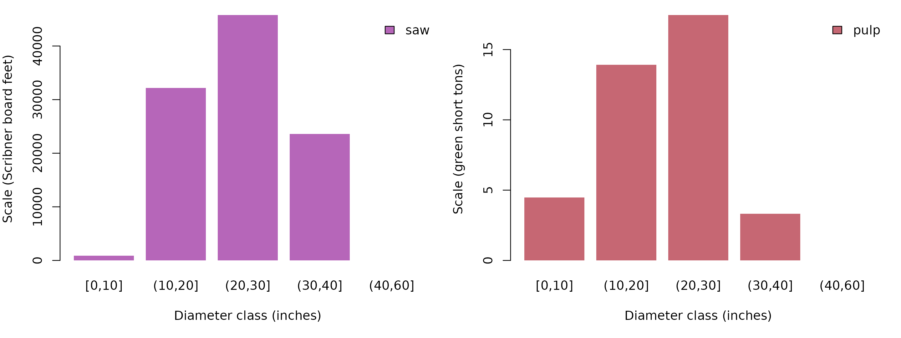
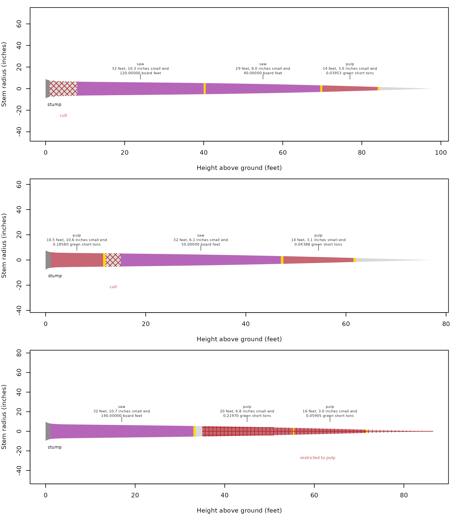
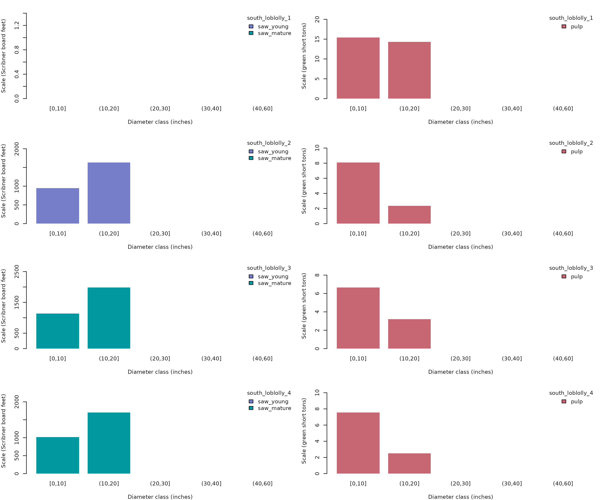

# Working a tree list

A tree-list calculation returns logs and residual sections keyed to the
original trees, so stand and species attributes can be joined back for
summaries. Use the same workflow for completed heights, located defects,
and stopper columns converted to defects. The shipped lists are
synthetic examples with diameters in inches and heights in feet, and
their unweighted totals describe the listed trees rather than an area
estimate.

## Which products apply to the Pacific Northwest list?

The specifications below accept sawlogs before pulp because that is
their order in
[`products()`](https://siskiyoubiometrics.com/merchandiser/reference/products.md).
The pulp name matches restrictions in the shipped defect records. The
sawlog sweep limit also gives the recorded sweep percentages an explicit
eligibility test.

``` r

## Attach the calculation and data tools
library(merchandiser)
library(dplyr)
```

``` r

## Assign sawlog dimensions and a sweep limit
saw <- product(product = 'saw',  ## product label
               min_length = 16,  ## feet
               max_length = 32,  ## feet
               trim = 0.5,  ## feet
               min_sed = 6,  ## inches inside bark
               max_sweep = 10,  ## percent
               volume_unit = 'scribner')  ## board feet

## Accept shorter and smaller sections as pulp
pulp <- product(product = 'pulp',  ## product label
                min_length = 8,  ## feet
                max_length = 20,  ## feet
                trim = 0.5,  ## feet
                min_sed = 3,  ## inches inside bark
                volume_unit = 'green_ton')  ## green short tons
```

``` r

## Combine products and retain the full tree list
specifications <- products(saw, pulp)

## Retain the tree attributes for later joins
trees <- example_trees_pnw
```

``` r

## Select logs with the matching located defects
pnw <- merchandise(tree_id = trees$tree_id,
                   dbh = trees$dbh,
                   ht = trees$ht,
                   spcd = trees$spcd,
                   products = specifications,
                   defects = example_defects_pnw)
```

A single call retains the tree identifier on every log, residual, and
status row. Trees with no selected logs still need review through their
residual and status records, because absence from the log table alone
does not identify the reason.

## How are logs summarized by stand?

Join attributes by `tree_id`, then group by the attributes and
measurement basis needed for the summary. Keeping both product and
`volume_unit` in the grouping prevents a board foot total from absorbing
weight scale. The example supplies no expansion factors, so none are
introduced here.

``` r

## Attach stand and diameter to each selected log
pnw_logs <- pnw$logs %>%
  left_join(y = trees %>%
              select(tree_id, stand, dbh),
            by = 'tree_id')

## Keep each product in its own scale unit
pnw_totals <- pnw_logs %>%
  group_by(stand, product, volume_unit) %>%
  summarize(scale = sum(scale), .groups = 'drop')
```

| stand    | product | scale (Scribner board feet) | scale (green short tons) |
|:---------|:--------|----------------------------:|-------------------------:|
| pnw_west | pulp    |                          NA |                   39.172 |
| pnw_west | saw     |                      102440 |                       NA |

The saw product totals 102440 Scribner board feet across the listed
Pacific Northwest trees.

Diameter classes can be calculated after the join, using the same tree
measurement for each of its logs. The separate panels below retain
product measurement units. Bars stack products only within a common
scale basis.

| product | diameter class (inches) | scale (Scribner board feet) | scale (green short tons) |
|:---|:---|---:|---:|
| pulp | \[0,10\] | NA | 4.476 |
| pulp | (10,20\] | NA | 13.917 |
| pulp | (20,30\] | NA | 17.456 |
| pulp | (30,40\] | NA | 3.322 |
| saw | \[0,10\] | 910 | NA |
| saw | (10,20\] | 32170 | NA |
| saw | (20,30\] | 45780 | NA |
| saw | (30,40\] | 23580 | NA |

The first diameter class contributes 4.476 green short tons to the pulp
panel.



The diameter-class bars allocate the same 102440 Scribner board feet
among the measured size classes, without combining it with pulp weight.

Logs in the stacked drawings

| tree_id | product | start (feet) | end (feet) | length (feet) | small-end diameter (inches) | scale (Scribner board feet) | scale (green short tons) |
|---:|:---|---:|---:|---:|---:|---:|---:|
| 7 | saw | 8.0 | 40.5 | 32.0 | 10.258 | 120 | NA |
| 7 | saw | 40.5 | 70.0 | 29.0 | 6.019 | 40 | NA |
| 7 | pulp | 70.0 | 84.5 | 14.0 | 3.017 | NA | 0.040 |
| 14 | pulp | 1.0 | 12.0 | 10.5 | 10.574 | NA | 0.186 |
| 14 | saw | 15.0 | 47.5 | 32.0 | 6.051 | 50 | NA |
| 14 | pulp | 47.5 | 62.0 | 14.0 | 3.092 | NA | 0.044 |
| 28 | saw | 1.0 | 33.5 | 32.0 | 10.731 | 140 | NA |
| 28 | pulp | 35.0 | 55.5 | 20.0 | 6.826 | NA | 0.220 |
| 28 | pulp | 55.5 | 72.0 | 16.0 | 3.039 | NA | 0.059 |

The first displayed tree starts cutting at 8 feet, above its cull.



The first stacked drawing begins above the cull ending at 8 feet. The
other drawings show how a later cull and a pulp restriction change cuts
on their respective trees.

## How do age limits change the southern products?

The southern list contains stands of different ages and stopper heights
for some trees. Age limits use inclusive lower and exclusive upper
endpoints. Passing the tree ages allows the same dimensions to produce
separate age-limited sawlog products without assigning those products
manually by stand.

``` r

## Accept sawlogs from younger qualifying trees
saw_young <- product(product = 'saw_young',  ## product label
                     min_age = 20,  ## years
                     max_age = 35,  ## years, excluded
                     min_length = 16,  ## feet
                     max_length = 32,  ## feet
                     trim = 0.5,  ## feet
                     min_sed = 6,  ## inches inside bark
                     volume_unit = 'scribner')  ## board feet

## Assign older qualifying trees to a separate sawlog product
saw_mature <- product(product = 'saw_mature',  ## product label
                      min_age = 35,  ## years
                      min_length = 16,  ## feet
                      max_length = 32,  ## feet
                      trim = 0.5,  ## feet
                      min_sed = 6,  ## inches inside bark
                      volume_unit = 'scribner')  ## board feet

## Keep smaller and age-ineligible wood eligible for pulp
pulp <- product(product = 'pulp',  ## product label
                min_length = 8,  ## feet
                max_length = 20,  ## feet
                trim = 0.5,  ## feet
                min_sed = 3,  ## inches inside bark
                volume_unit = 'green_ton')  ## green short tons
```

``` r

## Set the southern list and its ordered specifications
south_trees <- example_trees_south

## Offer age-qualified sawlogs before pulp
south_specs <- products(saw_young, saw_mature, pulp)
```

``` r

## Turn stopper columns into located defect records
south_defects <- defects_from_stoppers(tree_id = south_trees$tree_id,
                                       ht = south_trees$ht,
                                       topwood_product = 'pulp',
                                       saw_stop = south_trees$saw_stop,
                                       pulp_stop = south_trees$pulp_stop,
                                       jump_butt = south_trees$jump_butt)
```

``` r

## Apply age limits and converted stopping heights
south <- merchandise(tree_id = south_trees$tree_id,
                     dbh = south_trees$dbh,
                     ht = south_trees$ht,
                     spcd = south_trees$spcd,
                     products = south_specs,
                     age = south_trees$age,
                     defects = south_defects)
```

``` r

## Join stand ages to the southern log record
south_logs <- south$logs %>%
  left_join(y = south_trees %>%
              select(tree_id, stand, age, dbh),
            by = 'tree_id')

## Summarize products within stands and their own units
south_totals <- south_logs %>%
  group_by(stand, age, product, volume_unit) %>%
  summarize(scale = sum(scale), .groups = 'drop')
```

| stand | age (years) | product | scale (Scribner board feet) | scale (green short tons) |
|:---|---:|:---|---:|---:|
| south_loblolly_1 | 15 | pulp | NA | 29.697 |
| south_loblolly_2 | 25 | pulp | NA | 10.436 |
| south_loblolly_2 | 25 | saw_young | 2580 | NA |
| south_loblolly_3 | 35 | pulp | NA | 9.847 |
| south_loblolly_3 | 35 | saw_mature | 3120 | NA |
| south_loblolly_4 | 45 | pulp | NA | 10.042 |
| south_loblolly_4 | 45 | saw_mature | 2720 | NA |

The youngest stand is 15 years old and supplies pulp only under these
age limits. The other stands shift from the younger to the mature sawlog
product when their ages reach the specified boundary.

| stand | age (years) | product | diameter class (inches) | scale (Scribner board feet) | scale (green short tons) |
|:---|---:|:---|:---|---:|---:|
| south_loblolly_1 | 15 | pulp | \[0,10\] | NA | 15.389 |
| south_loblolly_1 | 15 | pulp | (10,20\] | NA | 14.308 |
| south_loblolly_2 | 25 | pulp | \[0,10\] | NA | 8.075 |
| south_loblolly_2 | 25 | pulp | (10,20\] | NA | 2.361 |
| south_loblolly_2 | 25 | saw_young | \[0,10\] | 950 | NA |
| south_loblolly_2 | 25 | saw_young | (10,20\] | 1630 | NA |
| south_loblolly_3 | 35 | pulp | \[0,10\] | NA | 6.642 |
| south_loblolly_3 | 35 | pulp | (10,20\] | NA | 3.205 |
| south_loblolly_3 | 35 | saw_mature | \[0,10\] | 1140 | NA |
| south_loblolly_3 | 35 | saw_mature | (10,20\] | 1980 | NA |
| south_loblolly_4 | 45 | pulp | \[0,10\] | NA | 7.543 |
| south_loblolly_4 | 45 | pulp | (10,20\] | NA | 2.499 |
| south_loblolly_4 | 45 | saw_mature | \[0,10\] | 1020 | NA |
| south_loblolly_4 | 45 | saw_mature | (10,20\] | 1700 | NA |

The youngest stand contributes 15.389 green short tons in its first
occupied diameter class.



The youngest stand supplies 29.697 green short tons across its pulp bars
and has no sawlog contribution. Each stand has a separate row, and pulp
remains on its own weight axis.

## Did any trees fail the calculation?

The status table contains only reported tree conditions. An empty table
indicates that no condition was recorded, not that every tree supplied
every product. Here a separate clean call and a deliberately invalid
diameter show the distinction without changing the shipped tree list.

``` r

## Keep a valid single tree for the status comparison
tree <- example_trees %>%
  filter(tree_id == 5)
```

``` r

## Select logs without located defects
clean <- merchandise(tree_id = tree$tree_id,
                     dbh = tree$dbh,
                     ht = tree$ht,
                     spcd = tree$spcd,
                     products = saw)
```

``` r

## Inspect the clean run's status rows
clean$status
#> [1] tree_id     status      name        description
#> <0 rows> (or 0-length row.names)
```

The clean run reports 0 status rows.

``` r

## Create a copy with an invalid diameter
bad_tree <- tree %>%
  mutate(dbh = -1)
```

``` r

## Inspect the effect of an invalid tree diameter
bad <- merchandise(tree_id = bad_tree$tree_id,
                   dbh = bad_tree$dbh,
                   ht = bad_tree$ht,
                   spcd = bad_tree$spcd,
                   products = saw)
```

| tree_id | status | name | description |
|---:|---:|:---|:---|
| 5 | 2 | invalid_dbh | Diameter at breast height must be greater than zero and at most 400 inches. |

The invalid diameter produces status 2, identifying the input that
prevented calculation.

``` r

## Look up the reported code's category and description
codes <- status_codes() %>%
  filter(status %in% bad$status$status)
```

| status | name | category | description | source |
|---:|:---|:---|:---|:---|
| 2 | invalid_dbh | input | Diameter at breast height must be greater than zero and at most 400 inches. | stem model |

Code 2 belongs to the input category.

## Which assumptions were recorded?

The result stores the equation and stump choice for each tree. When an
outside bark calculation needs a supplementary bark ratio, its record
includes the ratio’s source and diameter basis. Inspect these rows
before comparing runs that used different assignments or auxiliary
measurements.

``` r

## Extract the clean run's recorded assumptions
record <- assumptions(x = clean)
```

| tree_id | assumption | spcd | model | value (see unit column) | unit | basis | product | source |
|---:|:---|---:|:---|---:|:---|:---|:---|:---|
| 5 | species_model | 202 | F00FW2W202 | NA | NA | NA | NA | species_default |
| 5 | stump_height | 202 | F00FW2W202 | 1 | feet | NA | NA | stump_ht |

The stump row records 1 foot from the call’s stump input. The equation
row records its identifier and selection source, rather than an estimate
of model uncertainty.

## How are threads controlled?

[`threads()`](https://siskiyoubiometrics.com/merchandiser/reference/threads.md)
reports the current worker limit or changes it when supplied a count.
[`with_threads()`](https://siskiyoubiometrics.com/merchandiser/reference/with_threads.md)
restores the previous limit after evaluating an expression, including
when evaluation fails. The temporary setting below is useful when a
larger script needs a predictable calculation limit.

``` r

## Inspect the current thread limit
threads()
#> [1] 1

## Run a measurement under a temporary limit
with_threads(n = 1,
             code = dib(dbh = tree$dbh,
                        ht = tree$ht,
                        h = 20,
                        spcd = tree$spcd))
#>      value status
#> 1 15.63832      0
```

The temporary call uses the requested single worker and returns an
inside bark diameter in inches. Thread settings change execution
resources, not the product definitions or scale units.
